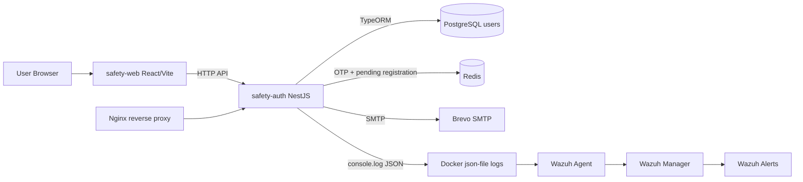
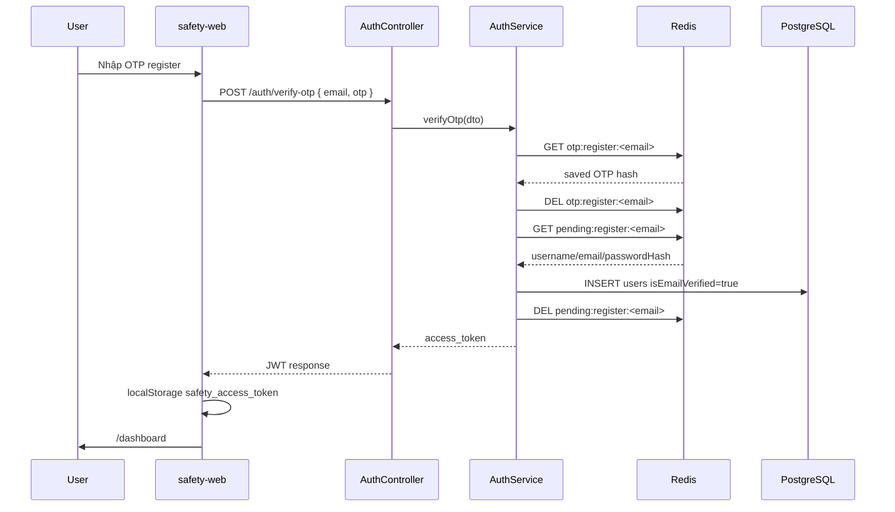
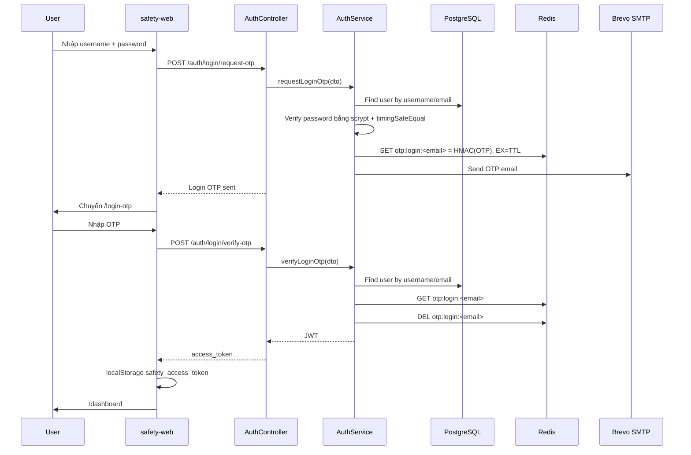
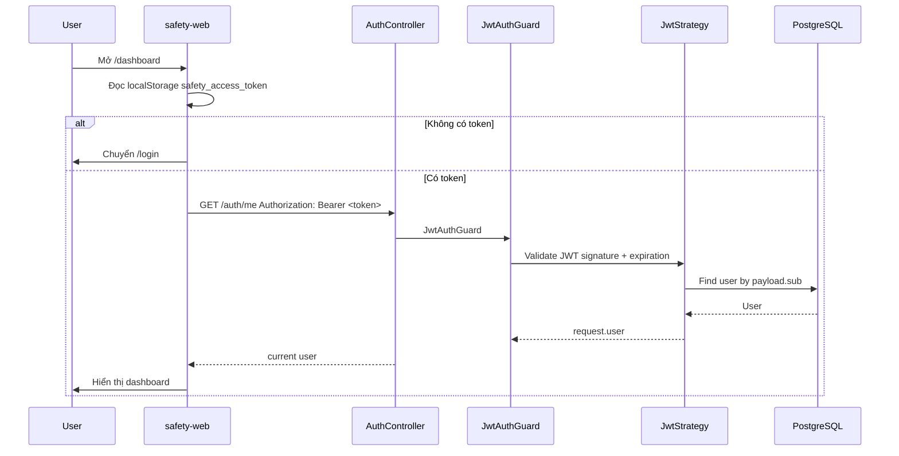
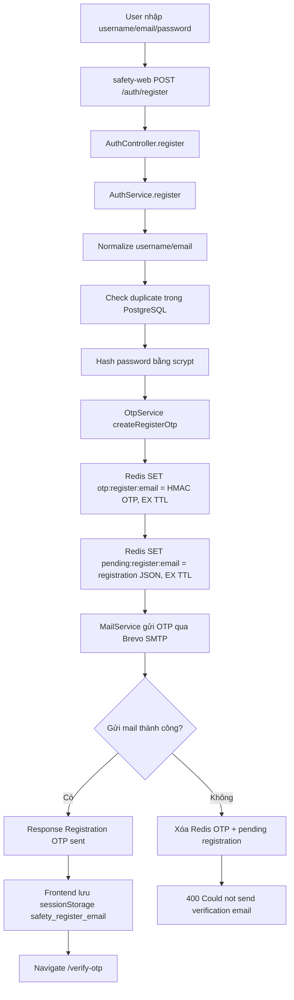
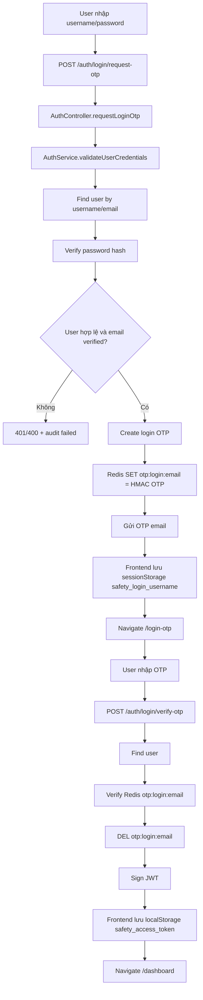
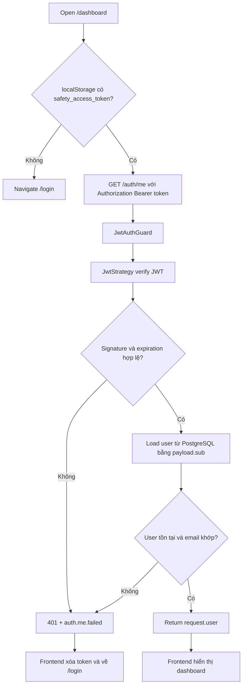

# Safety Auth - Giải thích flow hoạt động toàn dự án

Tài liệu này giải thích cách hệ thống Safety Auth hoạt động từ frontend đến backend, database, Redis, email OTP, JWT, audit log và Wazuh monitoring. Nội dung bám theo source code hiện tại của project.

## 1. Tổng quan hệ thống

Safety Auth là một hệ thống đăng ký, đăng nhập bằng mật khẩu kết hợp OTP qua email. Backend cấp JWT sau khi người dùng hoàn thành bước OTP. Frontend lưu JWT và luôn gọi `/auth/me` để xác thực lại session trước khi cho vào dashboard.

Các thành phần chính:

| Thành phần | Vai trò |
|---|---|
| `safety-web` | Frontend React/Vite. Hiển thị form register, verify OTP, login, login OTP và dashboard. |
| `safety-auth` | Backend NestJS. Nhận request auth, xử lý OTP, user, JWT, rate limit và audit log. |
| PostgreSQL | Lưu user đã xác thực email trong bảng `users`. |
| Redis | Lưu OTP tạm thời và pending registration với TTL. |
| Nginx | Reverse proxy tới backend `safety-auth:3000`. |
| Brevo SMTP | Dịch vụ email dùng để gửi OTP qua `nodemailer`. |
| Wazuh | Thu thập Docker logs, decode audit log JSON và tạo security alert. |

Khi chạy:

```bash
docker compose up -d
```

các container trong `docker-compose.yml` có vai trò:

| Container | Service | Vai trò |
|---|---|---|
| `safety-auth` | `safety-auth` | Chạy NestJS API ở port `3000`. Kết nối PostgreSQL, Redis, SMTP và sinh audit log ra stdout. |
| `safety-web` | `safety-web` | Chạy Vite dev server ở port `5173`. Gọi API qua `VITE_API_BASE_URL=http://localhost:3000`. |
| `safety-postgres` | `postgres` | Chạy PostgreSQL 16. Dữ liệu nằm trong volume `postgres_data`. |
| `safety-redis` | `redis` | Chạy Redis 7 có password. Dữ liệu nằm trong volume `redis_data`. |
| `safety-nginx` | `nginx` | Mở port `8080` và `8443`, proxy request tới `http://safety-auth:3000`. |

Wazuh không nằm trong lệnh compose chính. Wazuh dùng overlay:

```bash
docker compose -f wazuh-docker/single-node/docker-compose.yml -f docker-compose.wazuh.yml up -d
```

## 2. Kiến trúc tổng thể



Vì sao từng thành phần tồn tại:

- Frontend tách riêng để người dùng thao tác bằng UI.
- Backend giữ toàn bộ logic nhạy cảm: hash password, tạo OTP, verify OTP, ký JWT.
- PostgreSQL lưu dữ liệu bền vững của user.
- Redis lưu dữ liệu ngắn hạn như OTP để tự hết hạn sau vài phút.
- Nginx giúp gom route/proxy khi triển khai domain thật.
- Wazuh giúp giám sát các event auth bất thường từ log.

## 3. Flow Register

Register gồm hai pha:

1. User gửi username/email/password.
2. Backend gửi OTP qua email, nhưng chưa tạo user trong PostgreSQL.

### 3.1. User nhập form ở frontend

File: `safety-web/src/App.jsx`

Trang `RegisterPage` có form:

- `username`
- `email`
- `password`

Frontend yêu cầu password dài ít nhất 8 ký tự trước khi bật nút submit.

Khi submit, frontend gọi:

```js
apiPost('/auth/register', {
  username: form.username.trim(),
  email: form.email.trim(),
  password: form.password
})
```

API base URL lấy từ `safety-web/src/api.js`:

```js
const API_BASE_URL = import.meta.env.VITE_API_BASE_URL || 'http://localhost:3000';
```

Trong Docker compose, frontend dùng:

```env
VITE_API_BASE_URL=http://localhost:3000
```

### 3.2. Backend controller nhận request

Endpoint:

```http
POST /auth/register
```

File: `safety-auth/src/auth/auth.controller.ts`

Controller method:

```ts
@Throttle({ default: { limit: 3, ttl: 60_000 } })
@Post('register')
async register(@Body() registerDto: RegisterDto, @Req() request: Request)
```

DTO validate ở `safety-auth/src/auth/dto/register.dto.ts`:

| Field | Rule |
|---|---|
| `username` | string, tối thiểu 3 ký tự, chỉ gồm chữ/số/dấu `.`, `_`, `-` |
| `email` | email hợp lệ |
| `password` | string, tối thiểu 8 ký tự |

Ví dụ request:

```http
POST /auth/register
Content-Type: application/json

{
  "username": "alice",
  "email": "alice@example.com",
  "password": "StrongPass123"
}
```

### 3.3. Service xử lý register

File: `safety-auth/src/auth/auth.service.ts`

Method:

```ts
async register(registerDto: RegisterDto)
```

Các bước:

1. Normalize username/email:
   - `username.trim().toLowerCase()`
   - `email.trim().toLowerCase()`
2. Kiểm tra username/email đã tồn tại chưa qua `UsersService`.
3. Hash password bằng `scrypt`.
4. Tạo OTP register bằng `OtpService.createRegisterOtp(email)`.
5. Lưu pending registration vào Redis.
6. Gửi email OTP bằng `MailService.sendOtpEmail(email, otp)`.
7. Nếu gửi mail lỗi thì xóa OTP và pending registration khỏi Redis.
8. Trả response cho frontend.

Điểm quan trọng: ở bước register, user chưa được lưu vào PostgreSQL. Backend chỉ lưu pending registration trong Redis. User chỉ được tạo trong PostgreSQL sau khi OTP đúng.

### 3.4. Password được xử lý ra sao

File: `safety-auth/src/auth/auth.service.ts`

Password không lưu dạng plain text. Backend hash bằng:

```ts
const salt = randomBytes(16).toString('hex');
const derivedKey = await scrypt(password, salt, 64);
return `scrypt$${salt}$${derivedKey.toString('hex')}`;
```

Giá trị `passwordHash` này được lưu tạm trong Redis cùng pending registration. Sau khi OTP đúng, nó mới được lưu vào PostgreSQL.

### 3.5. OTP register được tạo ra sao

File: `safety-auth/src/otp/otp.service.ts`

OTP là mã 6 số:

```ts
randomInt(0, 1_000_000).toString().padStart(6, '0')
```

Backend không lưu OTP plain text trong Redis. Nó lưu HMAC SHA-256 của OTP:

```ts
HMAC_SHA256(secret, `${purpose}:${email}:${otp}`)
```

Với register, `purpose = "register"`.

Redis key:

```text
otp:register:<email-da-normalize>
```

Ví dụ:

```text
otp:register:alice@example.com
```

TTL lấy từ:

```env
OTP_TTL_SECONDS=300
```

mặc định là 300 giây nếu không cấu hình.

### 3.6. Pending registration lưu Redis thế nào

Redis key:

```text
pending:register:<email-da-normalize>
```

Ví dụ:

```text
pending:register:alice@example.com
```

Value là JSON:

```json
{
  "username": "alice",
  "email": "alice@example.com",
  "passwordHash": "scrypt$..."
}
```

Key này có cùng TTL với OTP. Nếu user không verify trong thời gian đó, pending registration hết hạn và phải register lại.

### 3.7. Email OTP gửi qua Brevo thế nào

File: `safety-auth/src/mail/mail.service.ts`

Backend dùng `nodemailer.createTransport()` với cấu hình:

```env
MAIL_HOST=smtp-relay.brevo.com
MAIL_PORT=587
MAIL_SECURE=false
MAIL_USER=your-brevo-smtp-login
MAIL_PASSWORD=your-brevo-smtp-key
MAIL_FROM_NAME=Safety
MAIL_FROM_EMAIL=your-verified-sender@example.com
```

Email có subject:

```text
Safety verification code
```

Nội dung email chứa OTP và thông báo OTP sẽ hết hạn sớm.

Nếu gửi mail thất bại:

- `MailService` log event `mail.otp.send.failed`, chỉ log lỗi SMTP an toàn.
- `AuthService.register()` xóa:
  - `pending:register:<email>`
  - `otp:register:<email>`
- Backend trả lỗi:

```json
{
  "message": "Could not send verification email. Please try again later.",
  "error": "Bad Request",
  "statusCode": 400
}
```

### 3.8. Response register

Nếu thành công:

```json
{
  "message": "Registration OTP sent. Please verify your email to finish creating your Safety account.",
  "username": "alice",
  "email": "alice@example.com"
}
```

Frontend sau đó lưu email vào sessionStorage:

```js
sessionStorage.setItem('safety_register_email', payload.email);
```

rồi chuyển sang:

```text
/verify-otp
```

Nếu thất bại thường gặp:

| Trường hợp | HTTP | Message |
|---|---:|---|
| Email đã tồn tại | 409 | `Email is already registered` |
| Username đã tồn tại | 409 | `Username is already registered` |
| Input sai format | 400 | Lỗi validation từ DTO |
| Gửi email lỗi | 400 | `Could not send verification email. Please try again later.` |
| Quá rate limit | 429 | Too many requests |

## 4. Flow Verify OTP Register



### 4.1. Frontend gửi API nào

File: `safety-web/src/App.jsx`

Trang `VerifyOtpPage` lấy email từ:

```js
sessionStorage.getItem('safety_register_email')
```

Sau đó gọi:

```js
apiPost('/auth/verify-otp', { email, otp })
```

Ví dụ request:

```http
POST /auth/verify-otp
Content-Type: application/json

{
  "email": "alice@example.com",
  "otp": "123456"
}
```

### 4.2. Backend kiểm tra OTP ở đâu

File: `safety-auth/src/auth/auth.controller.ts`

Endpoint:

```http
POST /auth/verify-otp
```

Controller gọi:

```ts
this.authService.verifyOtp(verifyOtpDto)
```

File: `safety-auth/src/auth/auth.service.ts`

Method:

```ts
async verifyOtp(verifyOtpDto: VerifyOtpDto)
```

Service gọi:

```ts
await this.otpService.verifyRegisterOtp(email, verifyOtpDto.otp);
```

File: `safety-auth/src/otp/otp.service.ts`

Redis key được đọc:

```text
otp:register:<email-da-normalize>
```

Nếu OTP sai format, sai mã hoặc hết hạn, backend trả:

```json
{
  "message": "Invalid or expired OTP",
  "error": "Bad Request",
  "statusCode": 400
}
```

Khi OTP đúng, `OtpService` xóa key OTP ngay:

```text
DEL otp:register:<email>
```

OTP vì vậy chỉ dùng một lần.

### 4.3. Khi OTP đúng thì user được update thế nào

Trong code hiện tại, user chưa tồn tại trong PostgreSQL trước khi verify. Vì vậy không phải update user cũ, mà là tạo user mới đã verified.

Backend đọc:

```text
pending:register:<email>
```

Sau đó gọi:

```ts
this.usersService.createVerified(username, email, passwordHash)
```

File: `safety-auth/src/users/users.service.ts`

`createVerified()` gọi `create(..., true)`, nên record trong bảng `users` có:

```json
{
  "username": "alice",
  "email": "alice@example.com",
  "passwordHash": "scrypt$...",
  "isEmailVerified": true
}
```

Bảng được định nghĩa ở `safety-auth/src/users/user.entity.ts`:

| Column | Ý nghĩa |
|---|---|
| `id` | UUID primary key |
| `username` | username unique |
| `email` | email unique |
| `passwordHash` | password đã hash |
| `isEmailVerified` | email đã verify hay chưa |
| `createdAt` | thời điểm tạo |
| `updatedAt` | thời điểm cập nhật |

Sau khi tạo user thành công, backend xóa:

```text
pending:register:<email>
```

### 4.4. JWT được tạo ở đâu

File: `safety-auth/src/auth/auth.service.ts`

Sau khi tạo user, service gọi:

```ts
return this.createAccessTokenResponse(user);
```

JWT payload:

```json
{
  "sub": "<user.id>",
  "email": "alice@example.com"
}
```

JWT được ký bằng:

```env
JWT_SECRET=...
JWT_EXPIRES_IN=1d
```

Response:

```json
{
  "access_token": "<jwt>",
  "token_type": "Bearer",
  "expires_in": "1d"
}
```

### 4.5. Frontend lưu token thế nào

File: `safety-web/src/App.jsx`

Sau khi verify OTP register thành công:

```js
localStorage.setItem('safety_access_token', data.access_token);
sessionStorage.removeItem('safety_register_email');
navigate('/dashboard');
```

`localStorage` giúp token còn tồn tại sau khi reload tab/browser. Nhưng frontend không chỉ tin `localStorage`; khi vào dashboard vẫn gọi `/auth/me` để backend xác thực token.

## 5. Flow Login OTP

Login hiện tại là login 2 bước:

1. `/auth/login/request-otp`: kiểm tra username/password, gửi OTP login.
2. `/auth/login/verify-otp`: kiểm tra OTP login, cấp JWT.

Endpoint cũ `/auth/login` vẫn tồn tại nhưng bị block bằng `GoneException`. Nó log event `auth.legacy_login.blocked`.



### 5.1. Bước 1: `/auth/login/request-otp`

Frontend file: `safety-web/src/App.jsx`

Trang `LoginPage` gọi:

```js
apiPost('/auth/login/request-otp', {
  username: form.username.trim(),
  password: form.password
})
```

Ví dụ request:

```http
POST /auth/login/request-otp
Content-Type: application/json

{
  "username": "alice",
  "password": "StrongPass123"
}
```

Controller:

```ts
@Throttle({ default: { limit: 5, ttl: 60_000 } })
@Post('login/request-otp')
async requestLoginOtp(...)
```

Service:

```ts
this.authService.requestLoginOtp(loginRequestOtpDto)
```

Password được kiểm tra ở:

```ts
AuthService.validateUserCredentials()
```

Các bước kiểm tra:

1. `findUserByIdentifierOrThrow(identifier)`
   - Nếu input có `@`, tìm bằng email.
   - Nếu không có `@`, tìm bằng username.
2. `verifyPassword(password, user.passwordHash)`
   - Tách `scrypt$salt$key`.
   - Hash password nhập vào với cùng salt.
   - So sánh bằng `timingSafeEqual`.
3. Kiểm tra `user.isEmailVerified`.

Nếu username/password sai:

```json
{
  "message": "Invalid username or password",
  "error": "Unauthorized",
  "statusCode": 401
}
```

Nếu email chưa verified:

```json
{
  "message": "Email is not verified",
  "error": "Bad Request",
  "statusCode": 400
}
```

Nếu đúng, backend tạo OTP login và gửi email:

```ts
const otp = await this.otpService.createLoginOtp(user.email);
await this.mailService.sendOtpEmail(user.email, otp);
```

Response thành công:

```json
{
  "message": "Login OTP sent to the registered email.",
  "username": "alice",
  "email": "alice@example.com"
}
```

Frontend lưu username tạm thời:

```js
sessionStorage.setItem('safety_login_username', payload.username);
```

rồi chuyển sang:

```text
/login-otp
```

### 5.2. OTP login khác OTP register ở điểm nào

| Nội dung | OTP register | OTP login |
|---|---|---|
| Mục đích | Xác minh email để tạo account | Xác minh bước 2 khi đăng nhập |
| Redis key OTP | `otp:register:<email>` | `otp:login:<email>` |
| Pending data | Có `pending:register:<email>` | Không có pending registration |
| Sau khi OTP đúng | Tạo user trong PostgreSQL rồi cấp JWT | Cấp JWT cho user đã tồn tại |
| Identifier từ frontend | Email lấy từ `safety_register_email` | Username lấy từ `safety_login_username` |

Hai loại OTP dùng cùng logic tạo mã 6 số, cùng TTL, cùng HMAC, nhưng khác `purpose`. Vì HMAC input có `purpose`, OTP register và OTP login không bị trộn logic với nhau.

### 5.3. Bước 2: `/auth/login/verify-otp`

Frontend gọi:

```js
apiPost('/auth/login/verify-otp', { username, otp })
```

Ví dụ request:

```http
POST /auth/login/verify-otp
Content-Type: application/json

{
  "username": "alice",
  "otp": "123456"
}
```

Controller:

```ts
@Throttle({ default: { limit: 10, ttl: 300_000 } })
@Post('login/verify-otp')
async verifyLoginOtp(...)
```

Service:

```ts
const user = await this.findUserByIdentifierOrThrow(loginVerifyOtpDto.username);
await this.otpService.verifyLoginOtp(user.email, loginVerifyOtpDto.otp);
return this.createAccessTokenResponse(user);
```

Redis key được đọc:

```text
otp:login:<email-da-normalize>
```

Nếu OTP đúng:

- Redis xóa `otp:login:<email>`.
- Backend tạo JWT bằng `createAccessTokenResponse(user)`.
- Frontend lưu:

```js
localStorage.setItem('safety_access_token', data.access_token);
sessionStorage.removeItem('safety_login_username');
navigate('/dashboard');
```

Response:

```json
{
  "access_token": "<jwt>",
  "token_type": "Bearer",
  "expires_in": "1d"
}
```

## 6. Flow Dashboard và JWT Guard



### 6.1. Frontend mở `/dashboard` thì làm gì

File: `safety-web/src/App.jsx`

`DashboardPage` chạy `useEffect()`:

1. Đọc token:

```js
const token = localStorage.getItem('safety_access_token');
```

2. Nếu không có token, chuyển về `/login`.
3. Nếu có token, gọi:

```http
GET /auth/me
Authorization: Bearer <token>
```

4. Nếu backend trả user hợp lệ, hiển thị dashboard.
5. Nếu backend trả lỗi, xóa token khỏi localStorage và chuyển về `/login`.

### 6.2. Vì sao không chỉ tin localStorage

`localStorage` nằm ở browser nên chỉ là nơi lưu token, không phải nguồn sự thật. Token trong localStorage có thể:

- Đã hết hạn.
- Bị sửa thủ công.
- Được ký bằng secret cũ.
- Trỏ tới user không còn tồn tại.
- Có payload không khớp user thật trong database.

Vì vậy dashboard phải gọi `/auth/me` để backend kiểm tra chữ ký JWT, hạn dùng và user trong PostgreSQL.

### 6.3. `/auth/me` hoạt động thế nào

File: `safety-auth/src/auth/auth.controller.ts`

```ts
@UseGuards(JwtAuthGuard)
@Get('me')
me(@Req() request: AuthenticatedRequest): AuthenticatedUser
```

Nếu guard xác thực thành công, `request.user` được trả về:

```json
{
  "id": "<uuid>",
  "username": "alice",
  "email": "alice@example.com",
  "isEmailVerified": true
}
```

### 6.4. JwtStrategy/JwtAuthGuard kiểm tra token ra sao

File: `safety-auth/src/auth/jwt.strategy.ts`

`JwtStrategy` lấy token từ header:

```http
Authorization: Bearer <jwt>
```

Cấu hình:

```ts
jwtFromRequest: ExtractJwt.fromAuthHeaderAsBearerToken(),
ignoreExpiration: false,
secretOrKey: JWT_SECRET
```

Nó kiểm tra:

1. Token có đúng format Bearer không.
2. Signature có đúng `JWT_SECRET` không.
3. Token có hết hạn chưa.
4. Payload có `sub` và `email`.
5. User `sub` có tồn tại trong PostgreSQL không.
6. Email trong token có khớp user trong DB không.

File: `safety-auth/src/auth/jwt-auth.guard.ts`

Nếu token lỗi hoặc hết hạn, `JwtAuthGuard.handleRequest()` log:

```json
{
  "event": "auth.me.failed",
  "status": "failed",
  "reason": "token_expired"
}
```

hoặc:

```json
{
  "event": "auth.me.failed",
  "status": "failed",
  "reason": "unauthorized"
}
```

Sau đó backend trả `401 Unauthorized`.

Frontend xử lý bằng cách:

```js
localStorage.removeItem('safety_access_token');
navigate('/login');
```

## 7. Flow Rate Limit

Rate limit dùng `@nestjs/throttler`.

Global default trong `safety-auth/src/app.module.ts`:

```ts
ThrottlerModule.forRoot([
  {
    ttl: 60_000,
    limit: 1000,
  },
])
```

Ngoài default global, một số endpoint auth có limit riêng:

| Endpoint | Limit | TTL | Ý nghĩa |
|---|---:|---:|---|
| `POST /auth/register` | 3 request | 60 giây | Hạn chế tạo account/gửi OTP register liên tục |
| `POST /auth/verify-otp` | 10 request | 300 giây | Hạn chế thử OTP register |
| `POST /auth/login/request-otp` | 5 request | 60 giây | Hạn chế thử password và gửi OTP login |
| `POST /auth/login/verify-otp` | 10 request | 300 giây | Hạn chế thử OTP login |
| Các endpoint khác | 1000 request | 60 giây | Default global |

Global guard:

```ts
{
  provide: APP_GUARD,
  useClass: AuditThrottlerGuard,
}
```

File: `safety-auth/src/auth/audit-throttler.guard.ts`

Khi request vượt limit:

1. `AuditThrottlerGuard.throwThrottlingException()` được gọi.
2. Backend ghi audit log:

```json
{
  "source": "safety-auth",
  "category": "authentication",
  "event": "auth.rate_limit.exceeded",
  "status": "blocked",
  "severity": "high",
  "reason": "too_many_requests"
}
```

3. NestJS trả HTTP `429 Too Many Requests`.

Vì sao cần rate limit cho OTP:

- OTP là mã ngắn 6 số và có thời hạn ngắn.
- Endpoint gửi OTP có thể bị lạm dụng để spam email.
- Endpoint verify OTP cần giới hạn số lần thử trong một khoảng thời gian.
- Rate limit cũng tạo tín hiệu cho Wazuh khi có hành vi bất thường.

## 8. Flow Audit Log

File: `safety-auth/src/auth/security-audit.service.ts`

`SecurityAuditService` tạo log JSON chuẩn hóa:

```json
{
  "timestamp": "2026-06-13T10:00:00.000Z",
  "source": "safety-auth",
  "category": "authentication",
  "event": "auth.login.password.failed",
  "status": "failed",
  "severity": "medium",
  "username": "alice",
  "ip": "127.0.0.1",
  "userAgent": "Mozilla/5.0",
  "reason": "invalid_credentials"
}
```

Log được ghi bằng:

```ts
console.log(JSON.stringify(entry));
```

Các field chính:

| Field | Ý nghĩa |
|---|---|
| `timestamp` | Thời điểm event xảy ra |
| `source` | Luôn là `safety-auth` để Wazuh nhận diện |
| `category` | Luôn là `authentication` cho nhóm auth |
| `event` | Tên event chi tiết |
| `status` | `success`, `failed`, hoặc `blocked` |
| `severity` | `low`, `medium`, hoặc `high` |
| `username` | Username liên quan nếu có |
| `email` | Email liên quan nếu có |
| `ip` | IP client, ưu tiên `x-forwarded-for` |
| `userAgent` | User-Agent của request |
| `reason` | Lý do lỗi đã normalize |

Các event đang được log:

| Event | Khi nào xảy ra |
|---|---|
| `auth.register.success` | Register gửi OTP thành công |
| `auth.register.failed` | Register thất bại |
| `auth.login.password.success` | Password login đúng và OTP login đã gửi |
| `auth.login.password.failed` | Sai username/password hoặc lỗi ở bước password |
| `auth.otp.verify.success` | Verify OTP register/login thành công |
| `auth.otp.verify.failed` | Verify OTP register/login thất bại |
| `auth.me.success` | `/auth/me` xác thực token thành công |
| `auth.me.failed` | `/auth/me` bị từ chối vì token lỗi/hết hạn |
| `auth.legacy_login.blocked` | Gọi endpoint password-only `/auth/login` đã bị vô hiệu hóa |
| `auth.rate_limit.exceeded` | Request vượt rate limit |

Vì sao không log password/OTP/JWT:

- Password là bí mật dài hạn; log password làm mất an toàn tài khoản.
- OTP là bí mật ngắn hạn; log OTP có thể làm OTP bị lộ trước khi hết hạn.
- JWT là bearer token; ai có token hợp lệ có thể gọi API như user đó cho tới khi token hết hạn.
- Audit log nên phục vụ điều tra và monitoring, không được chứa credential.

Code hiện tại tuân thủ hướng này: audit log chỉ ghi username/email/ip/userAgent/reason, không ghi password, OTP hoặc JWT.

## 9. Flow Wazuh

```mermaid
flowchart LR
  Auth[safety-auth NestJS] -->|console.log JSON| Stdout[Container stdout]
  Stdout --> DockerJson[/var/lib/docker/containers/*/*-json.log]
  DockerJson --> Tailer[wazuh.safety-auth-log-tailer]
  Tailer --> StableLog[/var/log/safety-auth-docker/docker-containers.log]
  DockerJson --> Agent[wazuh.agent.safety-auth]
  StableLog --> Agent
  Agent --> Manager[wazuh.manager]
  Manager --> Decoder[Safety Auth decoders]
  Decoder --> Rules[Safety Auth rules 100500-100599]
  Rules --> Alerts[Wazuh alerts]
```

### 9.1. safety-auth sinh log ra đâu

`SecurityAuditService` dùng:

```ts
console.log(JSON.stringify(entry));
```

Trong Docker, stdout của container được Docker ghi vào file log dạng `json-file`.

Đường dẫn host thường là:

```text
/var/lib/docker/containers/<container-id>/<container-id>-json.log
```

Mỗi dòng Docker log bọc nội dung stdout vào field `log`.

### 9.2. Wazuh agent đọc log thế nào

File: `docker-compose.wazuh.yml`

Có 2 container liên quan:

| Container | Vai trò |
|---|---|
| `wazuh.safety-auth-log-tailer` | Mount `/var/lib/docker/containers`, tail toàn bộ Docker json logs vào volume `safety-auth-docker-logs`. |
| `wazuh.agent.safety-auth` | Agent đọc Docker logs trực tiếp và đọc fallback log trong volume ổn định. |

File: `wazuh-config/agent/ossec.conf`

Agent đọc:

```xml
<localfile>
  <log_format>syslog</log_format>
  <location>/var/lib/docker/containers/*/*-json.log</location>
</localfile>
```

và fallback:

```xml
<localfile>
  <log_format>syslog</log_format>
  <location>/var/log/safety-auth-docker/docker-containers.log</location>
</localfile>
```

### 9.3. Decoder làm gì

File: `wazuh-config/decoders/0510-safety-auth_decoders.xml`

Decoder có hai hướng:

1. `safety-auth-json`: dùng khi log là JSON Safety Auth thuần và có `"source":"safety-auth"`.
2. `safety-auth-docker-json`: dùng khi JSON Safety Auth nằm bên trong Docker log wrapper.

Decoder trích xuất các field:

- `source`
- `category`
- `event`
- `status`
- `severity`
- `username`
- `email`
- `ip`
- `userAgent`
- `reason`

Decoder không quyết định cảnh báo nặng nhẹ. Nó chỉ biến log text thành field để rule dùng.

### 9.4. Rule làm gì

File: `wazuh-config/rules/1010-safety-auth_rules.xml`

Rule nhận event đã decode và tạo alert theo mức độ.

Một số rule quan trọng:

| Rule ID | Level | Điều kiện | Ý nghĩa |
|---:|---:|---|---|
| `100500` | 0 | `source=safety-auth`, `category=authentication` | Base rule cho JSON thuần |
| `100510` | 7 | `auth.login.password.failed` | Sai password/login |
| `100511` | 10 | 5 lần rule `100510` trong 300 giây cùng IP | Nhiều lần login fail từ cùng IP |
| `100520` | 8 | `auth.otp.verify.failed` | Verify OTP fail |
| `100521` | 11 | 5 lần OTP fail trong 300 giây cùng IP | Nhiều OTP fail từ cùng IP |
| `100522` | 11 | 5 lần OTP fail trong 300 giây cùng username | Nhiều OTP fail cho cùng username |
| `100530` | 10 | `auth.rate_limit.exceeded` | Vượt rate limit |
| `100531` | 12 | 3 lần rate limit trong 300 giây cùng IP | Rate limit lặp lại |
| `100540` | 9 | `auth.legacy_login.blocked` | Gọi endpoint login cũ bị chặn |
| `100550` | 6 | `auth.me.failed` | JWT validation fail |
| `100560` | 3 | `auth.login.password.success` | Password step thành công |
| `100570` | 3 | `auth.otp.verify.success` | OTP verify thành công |

Các rule `100580` đến `100589` là nhánh tương tự cho log bị bọc trong Docker `log` field.

## 10. Cấu trúc source code quan trọng

| File/folder | Vai trò | Flow sử dụng |
|---|---|---|
| `docker-compose.yml` | Định nghĩa stack chính: backend, frontend, PostgreSQL, Redis, Nginx. | Tổng quan, chạy project |
| `docker-compose.wazuh.yml` | Overlay thêm Wazuh agent/tailer và mount decoder/rule. | Wazuh logging |
| `.env.example` | Biến môi trường mẫu cho DB, Redis, JWT, OTP, SMTP, Wazuh. | Tất cả flow |
| `nginx/nginx.conf` | Reverse proxy từ Nginx sang `safety-auth:3000`. | Tổng quan deploy |
| `safety-auth/src/main.ts` | Bootstrap NestJS, bật CORS, bật global validation pipe. | Tất cả backend API |
| `safety-auth/src/app.module.ts` | Kết nối ConfigModule, Throttler, TypeORM, modules và global rate-limit guard. | Backend, PostgreSQL, rate limit |
| `safety-auth/src/auth/auth.module.ts` | Gom AuthController, AuthService, JwtStrategy, JwtAuthGuard, SecurityAuditService. | Auth flow |
| `safety-auth/src/auth/auth.controller.ts` | Định nghĩa endpoint `/auth/register`, `/auth/verify-otp`, `/auth/login/request-otp`, `/auth/login/verify-otp`, `/auth/me`. | Register, OTP, login, dashboard, audit |
| `safety-auth/src/auth/auth.service.ts` | Logic chính: register, verify OTP, password validation, JWT signing. | Register, login, JWT |
| `safety-auth/src/auth/dto/register.dto.ts` | Validate payload register. | Register |
| `safety-auth/src/auth/dto/verify-otp.dto.ts` | Validate payload verify OTP register. | Verify OTP register |
| `safety-auth/src/auth/dto/login-request-otp.dto.ts` | Validate payload bước password login. | Login request OTP |
| `safety-auth/src/auth/dto/login-verify-otp.dto.ts` | Validate payload verify OTP login. | Login verify OTP |
| `safety-auth/src/auth/jwt.strategy.ts` | Đọc Bearer token, verify signature/expiration, load user từ DB. | Dashboard, `/auth/me` |
| `safety-auth/src/auth/jwt-auth.guard.ts` | Guard bảo vệ `/auth/me`, log khi token lỗi/hết hạn. | Dashboard, audit |
| `safety-auth/src/auth/audit-throttler.guard.ts` | Global throttler guard có audit log khi vượt rate limit. | Rate limit, Wazuh |
| `safety-auth/src/auth/security-audit.service.ts` | Sinh audit log JSON chuẩn hóa. | Audit log, Wazuh |
| `safety-auth/src/otp/otp.module.ts` | Export `OtpService`. | OTP |
| `safety-auth/src/otp/otp.service.ts` | Tạo/verify OTP, hash OTP, lưu Redis, pending registration. | Register OTP, login OTP |
| `safety-auth/src/mail/mail.module.ts` | Export `MailService`. | Email OTP |
| `safety-auth/src/mail/mail.service.ts` | Gửi OTP qua SMTP/Brevo bằng nodemailer. | Register OTP, login OTP |
| `safety-auth/src/users/users.module.ts` | Đăng ký TypeORM repository cho `User`. | User DB |
| `safety-auth/src/users/user.entity.ts` | Entity TypeORM cho bảng `users`. | PostgreSQL |
| `safety-auth/src/users/users.service.ts` | Tạo user, tìm user, normalize username/email. | Register verify, login, JWT |
| `safety-web/src/api.js` | Wrapper `fetch`, parse response và normalize error. | Tất cả frontend API |
| `safety-web/src/App.jsx` | UI và routing client-side cho register, verify OTP, login, dashboard. | Tất cả frontend flow |
| `safety-web/src/main.jsx` | Mount React app vào DOM. | Frontend |
| `safety-web/src/styles.css` | Giao diện frontend. | Frontend |
| `wazuh-config/agent/ossec.conf` | Agent đọc Docker logs và gửi manager. | Wazuh |
| `wazuh-config/decoders/0510-safety-auth_decoders.xml` | Decoder parse Safety Auth audit log. | Wazuh |
| `wazuh-config/rules/1010-safety-auth_rules.xml` | Rule tạo alert auth. | Wazuh |

## 11. Mermaid: Register flow



## 12. Mermaid: Login OTP flow



## 13. Mermaid: JWT dashboard flow



## 14. Mermaid: Wazuh logging flow

```mermaid
flowchart TD
  A[Auth event trong NestJS] --> B[SecurityAuditService.log]
  B --> C[console.log JSON]
  C --> D[Docker json-file log]
  D --> E[Wazuh agent localfile]
  D --> F[Wazuh log tailer fallback]
  F --> G[/var/log/safety-auth-docker/docker-containers.log]
  G --> E
  E --> H[Wazuh manager]
  H --> I[Decoder safety-auth-json hoặc docker-json]
  I --> J[Rule 100500-100599]
  J --> K{Rule match?}
  K -->|Có| L[Wazuh alert]
  K -->|Không| M[Không tạo alert đáng kể]
```

## 15. Các file nên đọc theo thứ tự để hiểu project

1. `docker-compose.yml` - hiểu các service chạy cùng nhau.
2. `.env.example` - hiểu biến môi trường cần thiết.
3. `safety-web/src/App.jsx` - hiểu flow UI từ góc nhìn người dùng.
4. `safety-web/src/api.js` - hiểu frontend gọi API ra sao.
5. `safety-auth/src/main.ts` - hiểu app NestJS bootstrap và validation.
6. `safety-auth/src/app.module.ts` - hiểu module, DB và rate limit.
7. `safety-auth/src/auth/auth.controller.ts` - hiểu danh sách endpoint.
8. `safety-auth/src/auth/auth.service.ts` - hiểu logic nghiệp vụ chính.
9. `safety-auth/src/otp/otp.service.ts` - hiểu OTP và Redis key.
10. `safety-auth/src/users/user.entity.ts` - hiểu bảng users.
11. `safety-auth/src/users/users.service.ts` - hiểu thao tác user.
12. `safety-auth/src/mail/mail.service.ts` - hiểu gửi OTP qua SMTP.
13. `safety-auth/src/auth/jwt.strategy.ts` và `jwt-auth.guard.ts` - hiểu JWT dashboard.
14. `safety-auth/src/auth/security-audit.service.ts` - hiểu audit log.
15. `wazuh-config/decoders/0510-safety-auth_decoders.xml` - hiểu Wazuh parse log.
16. `wazuh-config/rules/1010-safety-auth_rules.xml` - hiểu Wazuh tạo alert.

## 16. Điểm còn dễ gây nhầm lẫn trong project

Một số điểm nên bổ sung comment hoặc tài liệu ngắn ngay trong code:

| Vị trí | Vì sao dễ nhầm |
|---|---|
| `AuthService.register()` | Dễ tưởng register tạo user trong PostgreSQL ngay. Thực tế chỉ lưu pending registration trong Redis. |
| `UsersService.markEmailVerified()` | Method này đang tồn tại nhưng flow register hiện tại không dùng; flow hiện tại tạo user verified sau OTP. |
| `AuthService.login()` | Method login password-only vẫn còn trong service nhưng controller `/auth/login` đã block bằng `GoneException`. |
| `SecurityAuditService` | Nên comment rõ không log secret như password, OTP, JWT. |
| `docker-compose.wazuh.yml` | Có đường dẫn mount dùng `../../...`, phụ thuộc cách chạy compose từ thư mục Wazuh; nên ghi rõ trong README hoặc comment. |
| Wazuh decoder Docker wrapper | Regex đang phục vụ Docker log wrapper; người mới có thể không hiểu vì sao có cả decoder JSON thuần và Docker branch. |

## 17. Tóm tắt flow end-to-end

Register:

1. User nhập username/email/password ở React.
2. React gọi `POST /auth/register`.
3. NestJS validate DTO và rate limit.
4. AuthService normalize input, kiểm tra trùng user, hash password.
5. OtpService tạo OTP register và lưu HMAC vào Redis.
6. OtpService lưu pending registration vào Redis.
7. MailService gửi OTP qua Brevo SMTP.
8. Frontend chuyển sang `/verify-otp`.
9. User nhập OTP.
10. React gọi `POST /auth/verify-otp`.
11. Backend verify `otp:register:<email>`.
12. Backend đọc `pending:register:<email>`.
13. Backend tạo user verified trong PostgreSQL.
14. Backend cấp JWT.
15. Frontend lưu JWT vào `localStorage` và vào dashboard.

Login:

1. User nhập username/password.
2. React gọi `POST /auth/login/request-otp`.
3. Backend kiểm tra password bằng hash trong PostgreSQL.
4. Backend tạo OTP login ở Redis key `otp:login:<email>`.
5. Backend gửi OTP qua email.
6. User nhập OTP.
7. React gọi `POST /auth/login/verify-otp`.
8. Backend verify OTP login.
9. Backend cấp JWT.
10. Frontend lưu JWT và vào dashboard.

Dashboard:

1. Frontend đọc token trong `localStorage`.
2. Frontend gọi `GET /auth/me`.
3. JwtAuthGuard/JwtStrategy xác thực token.
4. Backend load user từ PostgreSQL.
5. Nếu hợp lệ, frontend hiển thị dashboard.
6. Nếu không hợp lệ, frontend xóa token và quay lại login.

Monitoring:

1. Backend sinh audit log JSON cho success/failed/blocked auth event.
2. Docker ghi stdout vào json-file logs.
3. Wazuh agent đọc log.
4. Decoder parse field.
5. Rule tạo alert theo event và tần suất.
