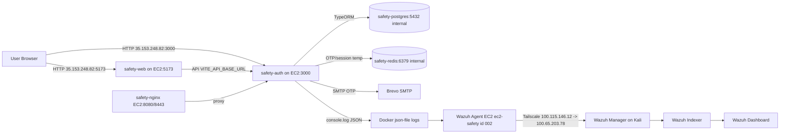
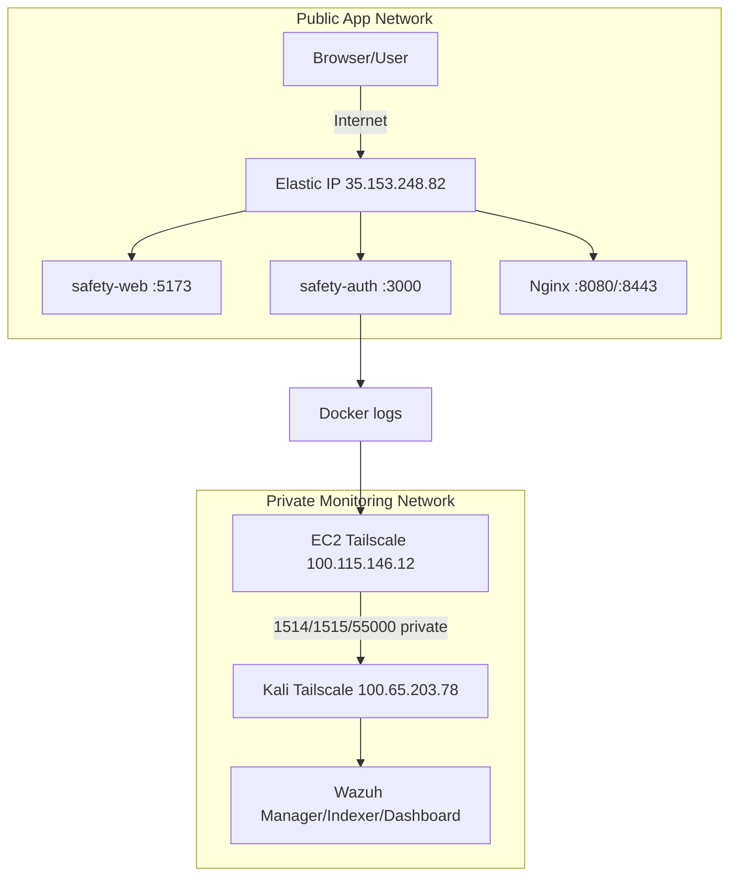
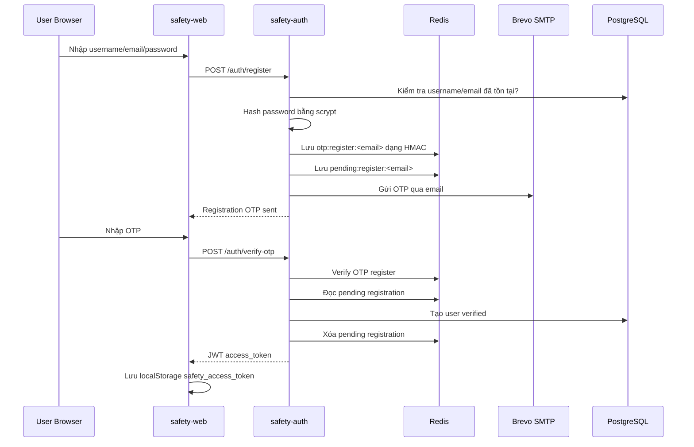
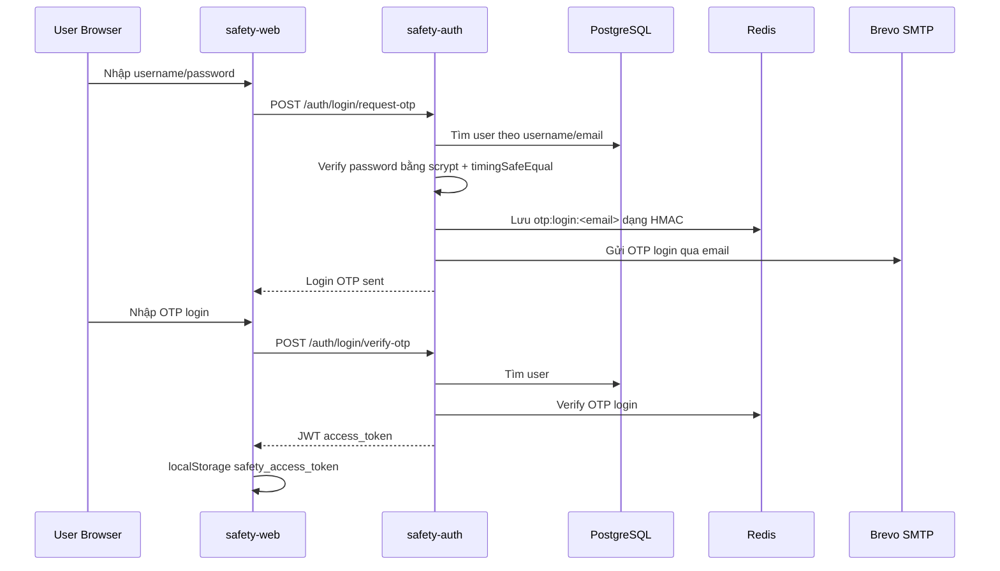
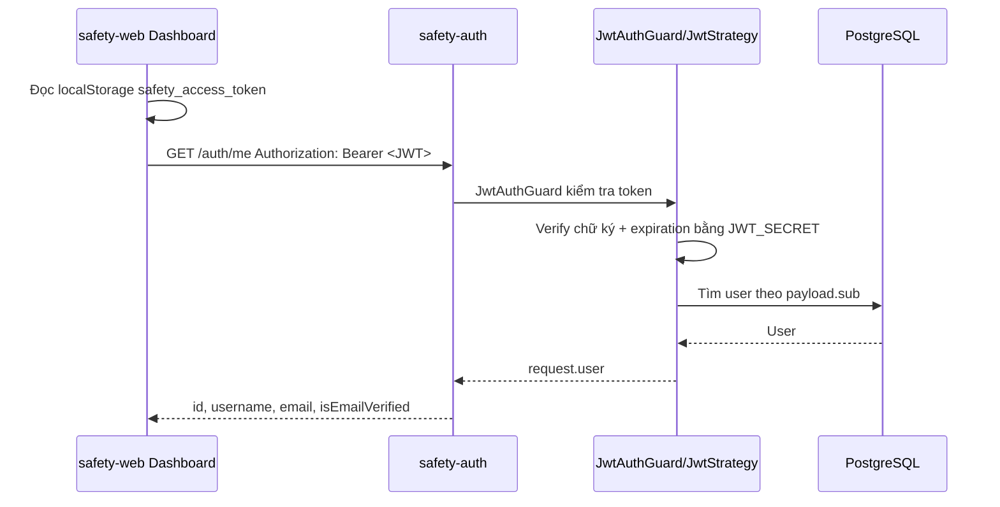
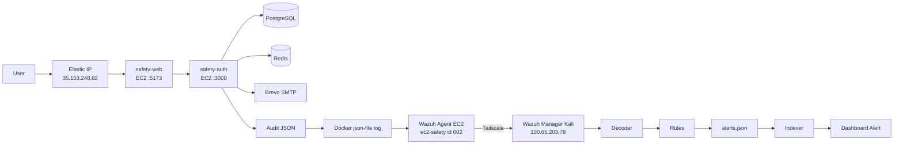

# Safety Auth - Flow hoạt động toàn dự án bản cập nhật

Tài liệu này giải thích flow end-to-end của Safety Auth từ local development, deploy lên EC2, đến monitoring bằng Wazuh chạy trên Kali qua Tailscale. Nội dung ưu tiên trạng thái triển khai mới nhất:

- App chạy trên EC2 Ubuntu, public qua Elastic IP `35.153.248.82`.
- `safety-web` chạy port `5173`, `safety-auth` chạy port `3000`.
- PostgreSQL và Redis chạy bằng Docker nội bộ trên EC2.
- Nginx chạy trên EC2 port `8080/8443`.
- Wazuh Manager/Indexer/Dashboard chạy trên Kali bằng Docker.
- EC2 chỉ chạy Wazuh Agent native, không chạy Wazuh Server trên EC2.
- Traffic monitoring đi qua Tailscale: EC2 `100.115.146.12` -> Kali `100.65.203.78`.

Tài liệu không chứa secret thật trong `.env`. Các giá trị như password SMTP, JWT secret, Redis password, Wazuh API password phải được giữ trong `.env` thật và không đưa vào báo cáo.

## 1. Tổng quan hệ thống

Safety Auth là hệ thống xác thực gồm đăng ký tài khoản, xác minh email bằng OTP, đăng nhập bằng password kết hợp OTP, cấp JWT session, ghi audit log và gửi log sang Wazuh để monitoring.

Flow nghiệp vụ chính:

1. Người dùng mở frontend `safety-web`.
2. Người dùng đăng ký bằng username, email, password.
3. Backend `safety-auth` tạo OTP, lưu trạng thái tạm vào Redis và gửi OTP qua email.
4. Người dùng nhập OTP để xác minh email.
5. Backend tạo user thật trong PostgreSQL và cấp JWT.
6. Khi đăng nhập, người dùng nhập username/password trước, sau đó nhập OTP gửi qua email.
7. Frontend lưu JWT trong `localStorage` với key `safety_access_token`.
8. Dashboard gọi `/auth/me` kèm JWT để kiểm tra session.
9. Backend ghi audit log dạng JSON ra stdout.
10. Docker ghi stdout vào Docker json log trên EC2.
11. Wazuh Agent trên EC2 đọc Docker log và gửi về Wazuh Manager trên Kali qua Tailscale.
12. Wazuh Manager áp decoder/rule, sinh alert, đẩy sang Indexer và hiển thị trên Dashboard.

Các thành phần quan trọng:

| Thành phần | Vai trò |
| --- | --- |
| `safety-web` | Frontend React/Vite, chạy trên EC2 port `5173`. |
| `safety-auth` | Backend NestJS, chạy trên EC2 port `3000`, xử lý auth, OTP, JWT, audit log. |
| PostgreSQL | Database lưu user đã xác minh email. |
| Redis | Lưu OTP, pending registration, attempts, lock và resend cooldown theo TTL. |
| Brevo SMTP | Dịch vụ gửi email OTP. |
| Nginx | Reverse proxy trên EC2 port `8080/8443`, hiện proxy về backend. |
| Wazuh Agent EC2 | Agent native đọc log trên EC2 và gửi sang Kali. |
| Wazuh Manager Kali | Nhận event từ agent, decode, match rule và sinh alert. |
| Wazuh Indexer | Lưu alert/event để search. |
| Wazuh Dashboard | UI xem agent, alert, rule, log security. |

## 2. Kiến trúc triển khai hiện tại

| Thành phần | Địa chỉ/port | Chạy ở đâu | Ghi chú |
| --- | --- | --- | --- |
| User Browser | `http://35.153.248.82:5173` | Máy người dùng | Truy cập frontend public. |
| Elastic IP | `35.153.248.82` | AWS EC2 | IP public cố định cho app. |
| EC2 Ubuntu | Public `35.153.248.82`, Tailscale `100.115.146.12` | AWS | Host chạy Docker app stack và Wazuh Agent. |
| Docker stack trên EC2 | Docker bridge `safety-net` | EC2 | Gồm `safety-web`, `safety-auth`, `postgres`, `redis`, `nginx`. |
| PostgreSQL | Docker internal `5432` | EC2 Docker | Không public ra Internet. |
| Redis | Docker internal `6379` | EC2 Docker | Không public ra Internet. |
| Nginx | Host `8080:80`, `8443:443` | EC2 Docker | Proxy về `safety-auth:3000`. |
| Tailscale | EC2 `100.115.146.12`, Kali `100.65.203.78` | EC2 + Kali | Private network cho monitoring. |
| Kali Wazuh Manager | `100.65.203.78:1514`, `1515`, `55000` | Kali Docker | Nhận log, enroll agent, cung cấp API. |
| Wazuh Indexer | Internal Docker trên Kali | Kali Docker | Lưu index alert/event. |
| Wazuh Dashboard | Kali port `443:5601` | Kali Docker | UI quản trị Wazuh. |
| Wazuh Agent EC2 | Native service `wazuh-agent` | EC2 Ubuntu | Agent name `ec2-safety`, agent id `002`. |

Agent cũ trên Ubuntu VM/local có tên `hyzuu`, agent id `001`. Agent này khác EC2 mới và không chứng minh EC2 đã được cài Wazuh Agent.



## 3. Hai lớp mạng: Public App Network và Private Monitoring Network

Hệ thống dùng song song Elastic IP và Tailscale vì hai mục đích khác nhau.

Public App Network là lớp cho người dùng truy cập app:

- Frontend: `http://35.153.248.82:5173`
- Backend API/debug: `http://35.153.248.82:3000`
- Nginx: `http://35.153.248.82:8080` hoặc `https://35.153.248.82:8443` nếu TLS được cấu hình

Elastic IP phù hợp cho browser/user vì:

- Người dùng ngoài Internet cần địa chỉ public để mở app.
- Elastic IP giữ ổn định khi EC2 restart.
- DNS/domain sau này có thể trỏ về Elastic IP.

Private Monitoring Network là lớp cho log/monitoring:

- EC2 Tailscale IP: `100.115.146.12`
- Kali Tailscale IP: `100.65.203.78`
- Wazuh Agent EC2 gửi event về Kali Wazuh Manager qua `100.65.203.78:1514/tcp`.
- Agent enroll qua `100.65.203.78:1515/tcp`.
- Backend nếu cần gọi Wazuh API thì dùng `https://100.65.203.78:55000`.

Không dùng Elastic IP cho Wazuh vì Wazuh Manager là hạ tầng quản trị nội bộ. Không nên mở các port `1514`, `1515`, `55000` ra Internet public. Nếu mở public, bất kỳ máy nào trên Internet cũng có thể quét hoặc cố kết nối tới service quản trị Wazuh. Tailscale giải quyết vấn đề này bằng mạng private giữa EC2 và Kali: EC2 vẫn gọi được Kali dù Kali không có public IP ổn định, còn Wazuh Manager không bị exposed ra Internet.



## 4. Docker stack trên EC2

Lệnh deploy app chính:

```bash
docker compose up -d --build
```

Compose chính chạy 5 service:

| Service | Container | Port host | Vai trò |
| --- | --- | --- | --- |
| `safety-web` | `safety-web` | `5173:5173` | Frontend React/Vite. |
| `safety-auth` | `safety-auth` | `3000:3000` | Backend NestJS API. |
| `postgres` | `safety-postgres` | Internal `5432` | Database user. |
| `redis` | `safety-redis` | Internal `6379` | OTP, pending state, attempts, cooldown. |
| `nginx` | `safety-nginx` | `8080:80`, `8443:443` | Reverse proxy tới backend. |

PostgreSQL và Redis chỉ nằm trong Docker network `safety-net`, không bind ra host. Backend gọi chúng bằng hostname service:

- `DB_HOST=postgres`
- `DB_PORT=5432`
- `REDIS_HOST=redis`
- `REDIS_PORT=6379`

Các biến môi trường quan trọng khi chạy trên EC2:

```env
APP_URL=http://35.153.248.82:3000
FRONTEND_URL=http://35.153.248.82:5173
VITE_API_BASE_URL=http://35.153.248.82:3000
DOMAIN=35.153.248.82
WAZUH_API_URL=https://100.65.203.78:55000
```

Ý nghĩa:

| Biến | Dùng bởi | Ý nghĩa |
| --- | --- | --- |
| `APP_URL` | Backend/config deploy | URL public của API. |
| `FRONTEND_URL` | Backend CORS | Origin frontend được phép gọi API. |
| `VITE_API_BASE_URL` | Frontend Vite | Base URL mà browser sẽ gọi khi frontend dùng `fetch`. |
| `DOMAIN` | Deploy/nginx/cert config | Tên miền hoặc IP public cho app. |
| `WAZUH_API_URL` | Backend nếu tích hợp Wazuh API | Nên trỏ tới Kali qua Tailscale, không qua public Internet. |

Điểm đặc biệt của `VITE_API_BASE_URL`:

- File `safety-web/src/api.js` đọc `import.meta.env.VITE_API_BASE_URL`.
- Nếu không có biến này, frontend fallback về `http://localhost:3000`.
- Trong browser của người dùng, `localhost` nghĩa là máy của người dùng, không phải EC2.
- Vì vậy nếu container `safety-web` vẫn build/run với `VITE_API_BASE_URL=http://localhost:3000`, người dùng mở `35.153.248.82:5173` sẽ gặp lỗi `Failed to fetch`, vì browser đang cố gọi `http://localhost:3000` trên chính máy người dùng.

Lưu ý: `docker-compose.yml` trong repo có default local cho `safety-web` là `VITE_API_BASE_URL=http://localhost:3000`. Khi deploy EC2 public, cần override thành `http://35.153.248.82:3000` bằng `.env`, compose override, hoặc chỉnh cấu hình deploy phù hợp. Đây là thay đổi cấu hình deploy, không phải thay đổi logic auth.

## 5. Flow Register

Register gồm hai pha: tạo pending registration và xác minh OTP. User chỉ được tạo trong PostgreSQL sau khi OTP đúng.



Chi tiết flow:

1. Frontend `RegisterPage` gọi `POST /auth/register` với `username`, `email`, `password`.
2. Backend normalize username/email về dạng thống nhất.
3. Backend kiểm tra username/email trong PostgreSQL bằng `UsersService`.
4. Password được hash bằng `scrypt`, không lưu plain text.
5. `OtpService` tạo OTP 6 số cho purpose `register`.
6. OTP không được lưu plain text. Redis lưu HMAC SHA-256 của OTP theo key `otp:register:<email>`.
7. Backend lưu pending registration trong Redis theo key `pending:register:<email>`, gồm username, email và password hash.
8. Backend gửi OTP qua Brevo SMTP.
9. Nếu gửi mail lỗi, backend xóa OTP và pending registration khỏi Redis để tránh trạng thái treo.
10. Người dùng nhập OTP ở trang verify.
11. Frontend gọi `POST /auth/verify-otp`.
12. Backend verify OTP, đọc pending registration, tạo user trong PostgreSQL.
13. Backend cấp JWT và frontend lưu vào `localStorage`.

Redis register key quan trọng:

| Key | Nội dung |
| --- | --- |
| `otp:register:<email>` | HMAC của OTP register. |
| `pending:register:<email>` | Username, email, password hash chờ xác minh. |
| `otp:attempts:register:<email>` | Số lần nhập OTP sai. |
| `otp:locked:register:<email>` | Lock khi nhập sai quá nhiều lần. |
| `otp:resend:register:<email>` | Số lần resend OTP. |
| `otp:resend:cooldown:register:<email>` | Cooldown trước khi resend tiếp. |

## 6. Flow Login password + OTP

Login không cấp JWT ngay sau password. Password đúng chỉ mở bước gửi OTP login.



Các bước chính:

1. Frontend gọi `POST /auth/login/request-otp`.
2. Backend tìm user bằng username hoặc email.
3. Backend verify password bằng `scrypt` và `timingSafeEqual`.
4. Nếu password sai, backend trả lỗi và ghi audit event `auth.login.password.failed`.
5. Nếu password đúng, backend tạo OTP purpose `login`, lưu HMAC vào Redis và gửi email.
6. Backend ghi audit event `auth.login.password.success`.
7. Frontend chuyển sang trang nhập OTP login.
8. Frontend gọi `POST /auth/login/verify-otp`.
9. Backend verify OTP login.
10. Nếu OTP đúng, backend cấp JWT.
11. Frontend lưu JWT vào `localStorage` key `safety_access_token`.

Legacy endpoint `POST /auth/login` bị chặn. Khi bị gọi, backend ghi event `auth.legacy_login.blocked` và trả thông báo yêu cầu dùng OTP login flow.

## 7. Flow Dashboard /auth/me

Dashboard không tin riêng việc token tồn tại trong browser. Nó gọi backend để xác thực lại JWT.



Nếu token hợp lệ:

- `JwtStrategy` verify chữ ký JWT bằng `JWT_SECRET`.
- `ignoreExpiration=false`, nên token hết hạn sẽ bị từ chối.
- Strategy lấy `sub` trong payload để tìm user.
- Nếu user tồn tại và email khớp, backend trả thông tin user.
- Backend ghi audit event `auth.me.success`.

Nếu token sai/hết hạn/không còn khớp user:

- Request bị từ chối.
- Frontend xóa `localStorage.safety_access_token`.
- Frontend chuyển người dùng về login.
- Với các lỗi được controller bắt được, backend ghi event thất bại tương ứng. Riêng lỗi guard có thể được ghi theo cơ chế filter/guard nếu được cấu hình.

## 8. Flow Audit Log trong backend

`SecurityAuditService` tạo audit log dạng JSON và ghi bằng `console.log(JSON.stringify(entry))`. Vì backend chạy trong Docker, log này đi ra stdout của container `safety-auth`.

Ví dụ cấu trúc log:

```json
{
  "timestamp": "2026-06-18T00:00:00.000Z",
  "source": "safety-auth",
  "category": "authentication",
  "event": "auth.login.password.failed",
  "status": "failed",
  "severity": "medium",
  "username": "alice",
  "ip": "203.0.113.10",
  "userAgent": "Mozilla/5.0",
  "reason": "invalid_credentials"
}
```

Nguyên tắc log:

- Không log password.
- Không log OTP.
- Không log JWT.
- Chỉ log metadata phục vụ audit: event, status, severity, username/email khi phù hợp, IP, user-agent, reason.

Các event quan trọng:

| Event | Ý nghĩa |
| --- | --- |
| `auth.register.success` | Register request hợp lệ, OTP đã gửi. |
| `auth.register.failed` | Register lỗi. |
| `auth.login.password.success` | Password đúng, OTP login đã gửi. |
| `auth.login.password.failed` | Sai username/password hoặc lỗi bước password. |
| `auth.otp.verify.success` | OTP verify thành công. |
| `auth.otp.verify.failed` | Rule cũ/nhánh raw cho OTP verify failed. |
| `auth.otp.attempt.failed` | Một lần nhập OTP sai. |
| `auth.otp.locked` | OTP flow bị khóa do sai quá nhiều lần. |
| `auth.otp.resend.success` | Gửi lại OTP thành công. |
| `auth.otp.resend.failed` | Gửi lại OTP lỗi. |
| `auth.otp.resend.blocked` | Resend bị chặn do rate/cooldown. |
| `auth.me.success` | JWT hợp lệ khi gọi `/auth/me`. |
| `auth.me.failed` | JWT validation failed theo rule Wazuh. |
| `auth.rate_limit.exceeded` | Rate limit bị vượt. |
| `auth.legacy_login.blocked` | Endpoint login cũ bị chặn. |

## 9. Flow Docker log

Backend không ghi trực tiếp vào file custom. Nó ghi JSON ra stdout:

```text
safety-auth console.log(JSON.stringify(entry))
```

Docker dùng log driver `json-file` mặc định và ghi stdout/stderr vào host:

```text
/var/lib/docker/containers/<container-id>/<container-id>-json.log
```

Log Docker có wrapper, ví dụ field `log` chứa JSON của app dưới dạng string. Wazuh decoder/rule vì vậy có hai nhánh:

- Nhánh raw JSON khi test bằng `wazuh-logtest` hoặc ingest không qua Docker wrapper.
- Nhánh Docker json-file khi log app nằm trong field `log`.

Container ID thay đổi khi container bị recreate, ví dụ sau:

```bash
docker compose up -d --build
docker compose down
docker compose up -d
```

Vì vậy không cấu hình Wazuh Agent đọc một path container ID cố định. Phải dùng wildcard:

```xml
<localfile>
  <log_format>syslog</log_format>
  <location>/var/lib/docker/containers/*/*-json.log</location>
</localfile>
```

Nếu dùng path cũ như:

```text
/var/lib/docker/containers/old-container-id/old-container-id-json.log
```

thì sau khi recreate container, file đó không còn tồn tại hoặc không còn nhận log mới. Kết quả là Wazuh vẫn thấy agent active, vẫn có SCA, nhưng không thấy event `safety-auth`.

## 10. Flow Wazuh remote monitoring

Kiến trúc Wazuh hiện tại là remote monitoring:

- Wazuh Server không chạy trên EC2.
- Wazuh Manager, Indexer, Dashboard chạy trên Kali bằng Docker compose `docker-compose.kali-wazuh.yml`.
- Wazuh Agent chạy native trên EC2 Ubuntu bằng package `wazuh-agent`.
- Agent EC2 tên `ec2-safety`, agent id `002`.
- Ubuntu VM/local cũ có agent `hyzuu`, agent id `001`.

Port Wazuh dùng trong private Tailscale:

| Port | Hướng | Mục đích |
| --- | --- | --- |
| `1514/tcp` | EC2 Agent -> Kali Manager | Gửi event/log. |
| `1515/tcp` | EC2 Agent -> Kali Manager | Enrollment/auth agent. |
| `55000/tcp` | Backend/admin -> Kali Manager API | Wazuh API nếu cần. |

Agent EC2 enroll bằng:

```bash
sudo /var/ossec/bin/agent-auth -m 100.65.203.78 -p 1515 -A ec2-safety
```

Sau khi enroll, `/var/ossec/etc/client.keys` trên EC2 không còn rỗng và chứa key agent. Trước khi enroll thành công, `client.keys` có thể rỗng, khi đó agent chưa có identity để kết nối manager.

Flow log:

```mermaid
flowchart LR
  Auth[safety-auth] -->|console.log audit JSON| DockerJson[Docker json logs<br/>/var/lib/docker/containers/*/*-json.log]
  DockerJson --> Agent[Wazuh Agent EC2<br/>ec2-safety id 002]
  Agent -->|TCP 1514 via Tailscale| Kali1514[100.65.203.78:1514<br/>Wazuh Manager]
  Agent -. enroll .->|TCP 1515 via Tailscale| Kali1515[100.65.203.78:1515<br/>Enrollment]
  Kali1514 --> Decoder[Safety Auth Decoder]
  Decoder --> Rule[Safety Auth Rules]
  Rule --> Alerts[alerts.json]
  Alerts --> Indexer[Wazuh Indexer]
  Indexer --> Dashboard[Wazuh Dashboard]
```

Nếu Dashboard chỉ thấy SCA mà không thấy Safety Auth logs, nghĩa là agent đã gửi được một số dữ liệu hệ thống, nhưng chưa đọc hoặc chưa gửi Docker json log của app. Nguyên nhân phổ biến là thiếu `<localfile>` Docker log trong `/var/ossec/etc/ossec.conf` trên EC2, hoặc path log dùng container ID cũ.

## 11. Wazuh Decoder và Rule

File decoder:

```text
wazuh-config/decoders/0510-safety-auth_decoders.xml
```

Vai trò:

- Nhận diện log có `"source":"safety-auth"`.
- Dùng `JSON_Decoder` cho raw Safety Auth JSON.
- Có nhánh fallback cho Docker json-file, vì JSON app nằm bên trong field `log`.
- Tách các field như `source`, `category`, `event`, `status`, `severity`, `username`, `email`, `ip`, `userAgent`, `reason`.

File rule:

```text
wazuh-config/rules/1010-safety-auth_rules.xml
```

Rule ID `100500-100599` được reserve cho Safety Auth. Trong file có hai nhóm logic:

- Rule raw JSON: bắt field đã decode trực tiếp như `event`.
- Rule Docker wrapper: bắt nội dung trong field `log`.

Một số rule quan trọng:

| Rule ID | Mô tả |
| --- | --- |
| `100500` | Base rule cho Safety Auth raw authentication audit event. |
| `100510` | Raw JSON: password login failed. |
| `100511` | Raw JSON: nhiều lần password login failed cùng IP trong timeframe. |
| `100520` | Raw JSON: OTP verification failed. |
| `100530` | Raw JSON: rate limit exceeded. |
| `100540` | Raw JSON: legacy password-only login bị chặn. |
| `100560` | Raw JSON: password step success, OTP đã gửi. |
| `100570` | Raw JSON: OTP verification success. |
| `100501` | Base rule cho Safety Auth event từ Docker log wrapper. |
| `100580` | Docker logs: Safety Auth password login failed. |
| `100581` | Docker logs: Multiple Safety Auth password login failures. |
| `100582` | Docker logs: OTP verification failed. |
| `100583` | Docker logs: Multiple OTP failures. |
| `100584` | Docker logs: rate limit exceeded. |
| `100588` | Docker logs: login password success. |
| `100589` | Docker logs: OTP success. |
| `100598` | Docker logs: OTP attempt failed. |
| `100599` | Docker logs: OTP locked. |

Khi demo từ EC2 Docker logs, thường quan trọng nhất là nhánh Docker wrapper `100580-100599`, vì Wazuh Agent đọc `/var/lib/docker/containers/*/*-json.log`.

## 12. Flow deploy EC2

Deploy đúng trạng thái mới nên đi theo flow này:

1. Tạo EC2 Ubuntu 24.04, không dùng Amazon Linux.
2. Gán Elastic IP `35.153.248.82`.
3. Mở Security Group cho app:
   - `22/tcp` cho SSH, nên giới hạn IP cá nhân.
   - `80/tcp`, `443/tcp` nếu dùng port chuẩn.
   - `3000/tcp` nếu cho phép gọi trực tiếp backend.
   - `5173/tcp` cho frontend Vite.
   - `8080/tcp`, `8443/tcp` nếu dùng nginx mapping hiện tại.
4. Không mở public `5432`, `6379`, `1514`, `1515`, `55000`.
5. Cài Docker Engine và Docker Compose plugin.
6. Clone branch `phu`:

```bash
git clone --branch phu <repo-url> /opt/safety-project
cd /opt/safety-project
```

7. Tạo `.env` đúng IP public/private. Không commit `.env` thật.
8. Đảm bảo các biến public URL đúng:

```env
APP_URL=http://35.153.248.82:3000
FRONTEND_URL=http://35.153.248.82:5173
VITE_API_BASE_URL=http://35.153.248.82:3000
DOMAIN=35.153.248.82
WAZUH_API_URL=https://100.65.203.78:55000
```

9. Start app stack:

```bash
docker compose up -d --build
docker compose ps
```

10. Cài Tailscale trên EC2.
11. Chạy:

```bash
sudo tailscale up --ssh --hostname safety-ec2
tailscale ip -4
```

12. Kiểm tra EC2 ping được Kali qua Tailscale:

```bash
tailscale ping 100.65.203.78
```

13. Cài Wazuh Agent native trên EC2.
14. Enroll agent:

```bash
sudo /var/ossec/bin/agent-auth -m 100.65.203.78 -p 1515 -A ec2-safety
```

15. Sửa `/var/ossec/etc/ossec.conf` trên EC2 để server/manager trỏ về `100.65.203.78`.
16. Thêm localfile Docker log vào `/var/ossec/etc/ossec.conf`:

```xml
<localfile>
  <log_format>syslog</log_format>
  <location>/var/lib/docker/containers/*/*-json.log</location>
</localfile>
```

17. Restart agent:

```bash
sudo systemctl restart wazuh-agent
sudo systemctl status wazuh-agent --no-pager
```

18. Test login sai để sinh log `auth.login.password.failed`.
19. Kiểm tra trên Kali Wazuh Manager:

```bash
docker exec -it <wazuh-manager-container> /var/ossec/bin/agent_control -l
```

20. Kiểm tra Dashboard search:

```text
agent.name:ec2-safety
```

Lưu ý quan trọng: push code lên GitHub không đồng nghĩa EC2 tự có Docker, Tailscale, Wazuh Agent, `/var/ossec`, hay `systemd` service. GitHub chỉ lưu source code và file cấu hình trong repo. EC2 là máy mới, nên các package hệ thống phải được cài trên EC2:

- Docker tạo command `docker`, Docker service và container runtime.
- Tailscale tạo `tailscaled`, interface `tailscale0` và IP private.
- Wazuh Agent tạo thư mục `/var/ossec`, binary `/var/ossec/bin/*`, file `/var/ossec/etc/ossec.conf`, `client.keys` và service `wazuh-agent`.
- `systemd` service chỉ tồn tại sau khi package tương ứng được cài.

Vì vậy thấy file `wazuh-config/agent/ossec.remote-agent.conf` trong GitHub không có nghĩa `/var/ossec/etc/ossec.conf` đã tồn tại trên EC2.

## 13. Checklist debug end-to-end

| Check | Lệnh/cách kiểm tra | Kết quả đúng |
| --- | --- | --- |
| Browser mở frontend được không | Mở `http://35.153.248.82:5173` | UI Safety Auth hiện ra. |
| Backend trả response không | `curl -i http://35.153.248.82:3000/` | Có response từ NestJS, ví dụ Hello World. |
| Docker có đủ 5 container không | `docker compose ps` hoặc `docker ps` | Có `safety-web`, `safety-auth`, `safety-postgres`, `safety-redis`, `safety-nginx`. |
| Backend log có event auth không | `docker logs safety-auth --tail 100` | Thấy JSON chứa `auth.login.password.failed` khi test sai password. |
| Frontend API URL đúng không | DevTools Network trong browser | Request gọi `35.153.248.82:3000`, không phải `localhost:3000`. |
| EC2 ping Kali qua Tailscale không | `tailscale ping 100.65.203.78` | Có `pong`. |
| EC2 gọi được Wazuh port không | `nc -vz 100.65.203.78 1514` và `nc -vz 100.65.203.78 1515` | `succeeded`. |
| Agent đã active trên Manager chưa | Trên Kali: `/var/ossec/bin/agent_control -l` trong manager container | Có `ec2-safety` và trạng thái Active. |
| Agent EC2 đọc Docker logs chưa | `sudo tail -f /var/ossec/logs/ossec.log` | Có dòng `Analyzing file: /var/lib/docker/containers/...-json.log`. |
| Kali có alert từ EC2 không | Trên manager container: grep `alerts.json` | Có `agent.name` là `ec2-safety`. |
| Dashboard search có event không | Wazuh Dashboard search `agent.name:ec2-safety` | Thấy event/alert từ EC2. |

## 14. Các lỗi đã gặp và cách sửa

| Lỗi | Nguyên nhân | Cách phát hiện | Cách sửa |
| --- | --- | --- | --- |
| `apt-get: command not found` | EC2 ban đầu dùng Amazon Linux, không phải Ubuntu. Amazon Linux dùng `yum`/`dnf`, không có `apt-get`. | Chạy `cat /etc/os-release`; thấy Amazon Linux. | Tạo lại EC2 bằng Ubuntu Server 24.04/22.04, hoặc viết lại script cho Amazon Linux. Với project này nên dùng Ubuntu. |
| `Failed to fetch` trên frontend | `safety-web` đang dùng `VITE_API_BASE_URL=http://localhost:3000`. Browser người dùng gọi localhost của máy người dùng, không phải EC2. | DevTools Network thấy request tới `http://localhost:3000`. | Override `VITE_API_BASE_URL=http://35.153.248.82:3000`, rebuild/restart `safety-web`. |
| `Unit wazuh-agent.service could not be found` | EC2 mới chưa cài package `wazuh-agent`. GitHub có config không đồng nghĩa host đã có service. | `systemctl status wazuh-agent` báo không tìm thấy unit; `/var/ossec` không tồn tại. | Cài Wazuh Agent native trên EC2, rồi `systemctl daemon-reload`, `enable`, `restart`. |
| `Unable to connect to enrollment service` | EC2 chưa kết nối được Kali Wazuh Manager port `1515`, thường do chưa có Tailscale hoặc Kali/port chưa reachable. | `agent-auth` treo/lỗi; `nc -vz 100.65.203.78 1515` fail. | Cài/chạy Tailscale trên EC2 và Kali, kiểm tra `tailscale ping`, đảm bảo Wazuh Manager expose `1515/tcp` trên Kali Docker. |
| `Valid key received` nhưng `wazuh-agent` start fail | Enroll nhận key nhưng config agent sai, service không parse được hoặc server address không hợp lệ. | `agent-auth` báo valid key; `systemctl status wazuh-agent` fail; xem `/var/ossec/logs/ossec.log`. | Sửa `/var/ossec/etc/ossec.conf`, kiểm tra `<address>` và `<manager_address>`, restart agent. |
| `Invalid server address found: MANAGER_IP` | File config còn placeholder `MANAGER_IP` hoặc `KALI_WAZUH_MANAGER_IP_OR_TAILSCALE_DNS`, chưa thay bằng IP thật. | `/var/ossec/logs/ossec.log` báo invalid server address. | Thay placeholder bằng `100.65.203.78`, restart `wazuh-agent`. |
| `client.keys` rỗng trước khi enroll | Agent chưa enroll thành công nên chưa có key/identity. | `sudo cat /var/ossec/etc/client.keys` rỗng hoặc không có agent key. | Chạy `agent-auth -m 100.65.203.78 -p 1515 -A ec2-safety`, rồi restart agent. |
| Dashboard chỉ thấy SCA, không thấy `safety-auth` | Agent hoạt động nhưng chưa đọc Docker json log của app. | Dashboard có SCA/system event nhưng search `auth.login.password.failed` không có. | Thêm `<localfile>` đọc `/var/lib/docker/containers/*/*-json.log` vào `/var/ossec/etc/ossec.conf` trên EC2, restart agent. |
| Docker log path cũ no longer exists | Container recreate làm container ID đổi; config trỏ path cũ. | `ls` path cũ không tồn tại; `ossec.log` không còn analyzing file mới. | Dùng wildcard `/var/lib/docker/containers/*/*-json.log`. |
| Disk full do Wazuh vulnerability detection local | Wazuh local/full stack hoặc vulnerability data tiêu tốn nhiều disk trên máy nhỏ. | `df -h` đầy; Wazuh/Indexer log tăng nhanh. | Không chạy full Wazuh trên EC2; chỉ chạy Agent. Dọn log/volume không cần thiết có kiểm soát, tăng disk nếu cần. |
| `t3.micro` thiếu RAM khi build | `t3.micro` chỉ 1GB RAM, build NestJS/npm có thể chậm hoặc OOM. | Build treo, bị kill, `docker compose build` rất chậm; `free -h` thiếu RAM. | Dùng `t3.small`/`t3.medium`, hoặc tạo swap trước khi build. |
| Agent EC2 chỉ gửi SCA, chưa gửi Safety Auth logs | Thiếu localfile Docker json log trong `/var/ossec/etc/ossec.conf`. | Wazuh Manager thấy agent active và SCA, nhưng không thấy Docker app event. | Thêm localfile wildcard Docker log, restart agent, test login sai để sinh log mới. |

## 15. File quan trọng nên đọc

Các file trong repo:

| File/thư mục | Lý do nên đọc |
| --- | --- |
| `docker-compose.yml` | Định nghĩa 5 container app trên EC2 và port mapping. |
| `deploy-ec2.sh` | Script bootstrap EC2 Ubuntu: Docker, Tailscale, Wazuh Agent, clone branch `phu`, start stack. |
| `backup-before-deploy.sh` | Backup dữ liệu và cấu hình trước deploy/migration. |
| `docs/EC2_DEPLOYMENT_GUIDE.md` | Hướng dẫn deploy EC2, rủi ro config public URL. |
| `.env` | Cấu hình thật của app. Không in secret vào báo cáo. |
| `safety-auth/src/*` | Backend NestJS: auth, OTP, mail, user, JWT, audit. |
| `safety-web/src/*` | Frontend React/Vite: register, verify OTP, login, dashboard, API client. |
| `nginx/*` | Cấu hình reverse proxy. |
| `wazuh-config/rules/*` | Custom Wazuh rules cho Safety Auth. |
| `wazuh-config/decoders/*` | Custom Wazuh decoders cho Safety Auth JSON/Docker logs. |
| `wazuh-config/agent/ossec.remote-agent.conf` | Mẫu config Wazuh Agent đọc Docker logs và trỏ về Kali. |
| `docker-compose.kali-wazuh.yml` | Compose chạy Wazuh Manager/Indexer/Dashboard trên Kali. |

Các file trên máy runtime:

| File runtime | Nằm ở đâu | Lý do |
| --- | --- | --- |
| `/var/ossec/etc/ossec.conf` | EC2 | Config thật của Wazuh Agent EC2. |
| `/var/ossec/etc/client.keys` | EC2 | Key agent sau khi enroll. |
| `/var/ossec/logs/ossec.log` | EC2 | Debug agent start, connect manager, analyzing log file. |
| `/var/lib/docker/containers/*/*-json.log` | EC2 | Docker json log chứa stdout của `safety-auth`. |
| `/var/ossec/logs/alerts/alerts.json` | Kali manager container | Alert Wazuh sau decoder/rule. |
| `/var/ossec/bin/agent_control` | Kali manager container | Kiểm tra agent `hyzuu`/`ec2-safety` active. |

## 16. Kết luận flow cuối cùng

Flow cuối cùng của Safety Auth là:

```text
User
-> Elastic IP 35.153.248.82
-> EC2 safety-web port 5173
-> EC2 safety-auth port 3000
-> PostgreSQL / Redis / Brevo SMTP
-> Audit JSON trong backend
-> Docker json-file log trên EC2
-> Wazuh Agent native trên EC2: ec2-safety id 002
-> Tailscale private network
-> Kali Wazuh Manager tại 100.65.203.78
-> Safety Auth Decoder/Rule
-> alerts.json
-> Wazuh Indexer
-> Wazuh Dashboard Alert
```



Điểm cần nhớ khi demo/báo cáo:

- Elastic IP là đường public cho người dùng truy cập app.
- Tailscale là đường private cho monitoring EC2 -> Kali.
- Wazuh Server không chạy trên EC2; EC2 chỉ chạy Wazuh Agent.
- GitHub chỉ chứa source/config mẫu; EC2 vẫn phải cài Docker, Tailscale, Wazuh Agent và cấu hình `/var/ossec` riêng.
- Nếu Dashboard chỉ thấy SCA mà không thấy Safety Auth logs, hãy kiểm tra localfile Docker log wildcard trong `/var/ossec/etc/ossec.conf` trên EC2.
