# PROJECT REPORT - Safety Auth

**Ngay lap bao cao:** 2026-06-03  
**Du an:** Safety Auth  
**Pham vi doc:** Phan tich source code hien tai trong `/home/de180538_vutruonghuy/Project`.

---

## 1. Tong quan du an

### 1.1 Ten du an

**Safety Auth** la he thong xac thuc nguoi dung gom frontend React, backend NestJS, PostgreSQL, Redis OTP, Gmail SMTP, Nginx reverse proxy va kho Wazuh Docker de phuc vu muc tieu tich hop giam sat bao mat sau nay.

### 1.2 Muc tieu du an

Du an xay dung mot nen tang dang ky/dang nhap an toan cho brand **Safety**. Phien ban hien tai tap trung vao:

- Dang ky tai khoan bang `username`, `email`, `password`.
- Gui OTP qua Gmail SMTP de xac thuc email.
- Dang nhap 2 buoc bang `username/password` va OTP gui ve email da dang ky.
- Cap JWT access token sau khi verify OTP thanh cong.
- Cung cap giao dien web sach, hien dai, dang card giua man hinh.
- Dong goi runtime bang Docker Compose.
- Giu san Wazuh Docker source de tich hop SIEM/log monitoring trong giai doan sau.

### 1.3 Bai toan giai quyet

Bai toan chinh la tao mot cong xac thuc an toan hon dang nhap mat khau thong thuong. He thong yeu cau nguoi dung:

1. Co tai khoan da dang ky trong PostgreSQL.
2. Mat khau duoc hash, khong luu plaintext.
3. Email phai duoc verify bang OTP khi dang ky.
4. Moi lan dang nhap chinh thuc phai qua OTP gui ve email lien ket voi username.
5. Sau khi OTP hop le, frontend luu access token va cho vao dashboard.

### 1.4 Kien truc tong the he thong

Kien truc hien tai gom 5 thanh phan chinh trong compose chinh:

- `safety-web`: React/Vite frontend, port `5173`.
- `safety-auth`: NestJS API, port `3000`.
- `postgres`: PostgreSQL 16, luu bang `users`.
- `redis`: Redis 7, luu OTP hash tam thoi theo TTL.
- `nginx`: reverse proxy toi backend `safety-auth:3000`, port `8080` va `8443`.

Wazuh hien duoc de rieng trong thu muc `wazuh-docker`, chua gop vao compose chinh.

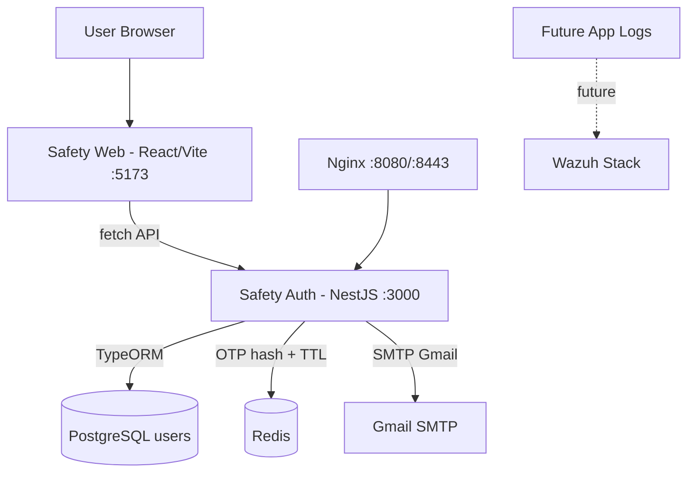

### 1.5 Cong nghe su dung

| Nhom | Cong nghe | Ghi chu |
| --- | --- | --- |
| Frontend | React 18, Vite 5, lucide-react, CSS thu cong | Nam trong `safety-web` |
| Backend | NestJS 11, TypeScript, TypeORM, class-validator | Nam trong `safety-auth` |
| Database | PostgreSQL 16 | Bang hien co: `users` |
| Redis | Redis 7 | Luu OTP hash key `otp:register:<email>`, `otp:login:<email>` |
| Docker | Docker Compose | Compose chinh chay app auth/web/db/redis/nginx |
| Wazuh | Wazuh Docker 4.14.0 source | Chua tich hop runtime app chinh |
| Nginx | nginx:latest | Reverse proxy `auth.safety.vn` ve backend |
| Authentication | Scrypt password hash, OTP email, JWT | Chua co refresh token |

---

## 2. Cau truc thu muc

### 2.1 Cay thu muc tong quan

```text
Project/
├── .env
├── .env.bak
├── README.md
├── PROJECT_REPORT.md
├── EXECUTIVE_SUMMARY.md
├── docker-compose.yml
├── certs/
├── nginx/
│   └── nginx.conf
├── safety-auth/
│   ├── Dockerfile
│   ├── package.json
│   ├── package-lock.json
│   ├── nest-cli.json
│   ├── tsconfig.json
│   ├── tsconfig.build.json
│   ├── eslint.config.mjs
│   ├── src/
│   │   ├── main.ts
│   │   ├── app.module.ts
│   │   ├── app.controller.ts
│   │   ├── app.service.ts
│   │   ├── auth/
│   │   ├── users/
│   │   ├── otp/
│   │   └── mail/
│   └── test/
├── safety-web/
│   ├── package.json
│   ├── package-lock.json
│   ├── index.html
│   ├── vite.config.js
│   ├── .env.example
│   └── src/
│       ├── main.jsx
│       ├── App.jsx
│       ├── api.js
│       └── styles.css
├── wazuh-dashboard-config/
│   └── opensearch_dashboards.yml
└── wazuh-docker/
    ├── single-node/
    ├── multi-node/
    ├── wazuh-agent/
    ├── build-docker-images/
    ├── indexer-certs-creator/
    ├── docs/
    └── README.md
```

### 2.2 Giai thich thu muc va file quan trong

#### Root project

- `.env`: cau hinh runtime cho Docker Compose va NestJS, gom DB, Redis, JWT, OTP, SMTP, Wazuh API. Day la file nhay cam, khong nen commit len Git.
- `.env.bak`: ban backup cau hinh cu.
- `docker-compose.yml`: compose chinh cua Safety Auth. Chay `safety-auth`, `safety-web`, `postgres`, `redis`, `nginx` tren network `safety-net`.
- `README.md`: ghi chu ngan cua project.
- `PROJECT_REPORT.md`: bao cao ky thuat nay.
- `EXECUTIVE_SUMMARY.md`: tom tat dieu hanh/phien ban bao cao tien do.

#### `safety-auth/`

Backend NestJS. File quan trong:

- `src/main.ts`: bootstrap Nest app, bat CORS, bat global `ValidationPipe`.
- `src/app.module.ts`: module goc, cau hinh ConfigModule, TypeORM, Postgres, import Auth/Users/Otp/Mail.
- `src/auth/auth.controller.ts`: dinh nghia endpoint `/auth/*`.
- `src/auth/auth.service.ts`: xu ly register, verify OTP, login OTP, password hash, JWT sign.
- `src/auth/dto/*.ts`: dinh nghia input validation cho register/login/OTP.
- `src/users/user.entity.ts`: TypeORM entity bang `users`.
- `src/users/users.service.ts`: tao user, tim user theo email/username, mark email verified.
- `src/otp/otp.service.ts`: tao/verify OTP bang Redis + HMAC hash.
- `src/mail/mail.service.ts`: gui email OTP bang Nodemailer SMTP.
- `Dockerfile`: multi-stage build NestJS bang Node 20 slim.

#### `safety-web/`

Frontend React/Vite. File quan trong:

- `src/App.jsx`: chua toan bo page, routing nhe, form, submit, local/session storage, navigation.
- `src/api.js`: wrapper `fetch` toi backend API.
- `src/styles.css`: responsive UI, card auth, error/success states.
- `.env.example`: khai bao `VITE_API_BASE_URL=http://localhost:3000`.
- `vite.config.js`: port dev `5173`.

#### `nginx/`

- `nginx.conf`: server listen port 80 voi `server_name auth.safety.vn`, proxy request den `http://safety-auth:3000`.

#### `certs/`

Thu muc mount certificate vao Nginx theo compose, hien tai khong co cau hinh TLS active trong `nginx.conf` doc duoc.

#### `wazuh-dashboard-config/`

- `opensearch_dashboards.yml`: cau hinh dashboard OpenSearch/Wazuh rieng, co username/password. Day la file nhay cam neu dung production.

#### `wazuh-docker/`

Source Wazuh Docker upstream/gan upstream:

- `single-node/docker-compose.yml`: Wazuh manager, indexer, dashboard trong single-node mode.
- `multi-node/docker-compose.yml`: Wazuh master/worker, 3 indexer, dashboard, nginx load forwarding.
- `wazuh-agent/docker-compose.yml`: agent Docker mau.
- `build-docker-images/`: Dockerfile build image Wazuh components.
- `indexer-certs-creator/`: tao cert cho Wazuh Indexer.
- `docs/`: tai lieu noi bo Wazuh Docker.

---

## 3. Kien truc he thong

### 3.1 So do tong the

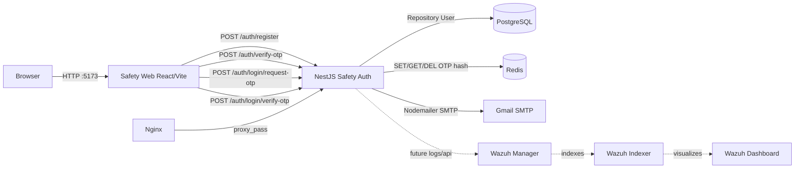

### 3.2 Luong frontend

Frontend nam trong `safety-web/src/App.jsx`. Ung dung khong dung React Router package, ma dung:

- `routes`: Set cac path hop le.
- `navigate(path)`: goi `window.history.pushState` va dispatch `popstate`.
- `useRoute()`: doc `window.location.pathname`, redirect mac dinh den `/dashboard` neu co token hoac `/login` neu chua co token.

Cac trang:

- `/register`: tao tai khoan, luu email tam vao `sessionStorage`, sang `/verify-otp`.
- `/verify-otp`: doc email tu `sessionStorage`, verify OTP, luu token vao `localStorage`, sang `/dashboard`.
- `/login`: nhap username/password, request login OTP, luu username tam vao `sessionStorage`, sang `/login-otp`.
- `/login-otp`: verify login OTP, luu token, sang `/dashboard`.
- `/dashboard`: yeu cau co `localStorage.safety_access_token`, hien thanh cong, logout xoa token.

### 3.3 Luong backend

Backend nam trong `safety-auth`:

- `main.ts`: bat CORS va validation.
- `app.module.ts`: cau hinh Postgres/TypeORM + import module.
- `auth.controller.ts`: map HTTP endpoints.
- `auth.service.ts`: xu ly nghiep vu auth.
- `users.service.ts`: thao tac user DB.
- `otp.service.ts`: thao tac OTP Redis.
- `mail.service.ts`: gui OTP email.

### 3.4 Luong database

PostgreSQL co bang `users`. TypeORM `synchronize=true` mac dinh neu env khong override. Backend tao user qua `UsersService.create`, update `isEmailVerified` qua `UsersService.markEmailVerified`.

OTP khong luu trong PostgreSQL. OTP luu Redis tam thoi theo TTL va duoc hash bang HMAC:

- Register: `otp:register:<email>`
- Login: `otp:login:<email>`

### 3.5 Luong Docker network

`docker-compose.yml` tao network `safety-net`. Cac service trong compose chinh cung join network nay:

- `safety-auth` ket noi `postgres` qua hostname `postgres`.
- `safety-auth` ket noi `redis` qua hostname `redis`.
- `nginx` proxy toi `safety-auth:3000`.
- `safety-web` chay Vite dev server va expose ra host port 5173. Browser goi backend qua `http://localhost:3000`.

### 3.6 Luong Wazuh integration

Hien tai Wazuh **chua tich hop truc tiep** vao compose chinh. Trong `.env` va compose co bien Wazuh API:

- `WAZUH_API_URL`
- `WAZUH_API_USERNAME`
- `WAZUH_API_PASSWORD`
- `WAZUH_API_TLS_REJECT_UNAUTHORIZED`

Nhung source `safety-auth/src` hien chua co service/controller nao goi Wazuh API. Huong tich hop tuong lai:

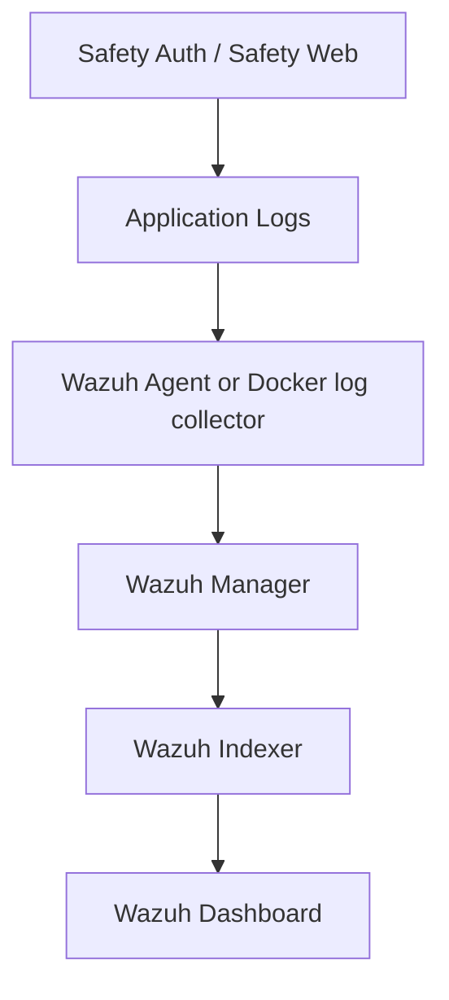

---

## 4. Phan tich Backend chi tiet

### 4.1 Bootstrap va global configuration

#### `safety-auth/src/main.ts`

Muc dich:

- Tao Nest app tu `AppModule`.
- Bat CORS cho `FRONTEND_URL`, `http://localhost:5173`, `http://127.0.0.1:5173`.
- Bat `ValidationPipe`:
  - `whitelist: true`: strip field khong co trong DTO.
  - `forbidNonWhitelisted: true`: reject field thua.
  - `transform: true`: transform input theo DTO.
- Listen port `process.env.PORT ?? 3000`.

Tac dong: frontend bat buoc gui dung payload DTO. Vi vay login OTP da duoc chinh de DTO nhan `username`, khong nhan `identifier` tren UI.

### 4.2 AppModule

#### `safety-auth/src/app.module.ts`

Muc dich:

- Load env tu `../.env` va `.env`.
- Cau hinh TypeORM Postgres:
  - host, port, username, password, database tu env.
  - entity: `[User]`.
  - `synchronize` mac dinh `true` neu khong set `TYPEORM_SYNCHRONIZE=false`.
- Import `UsersModule`, `OtpModule`, `MailModule`, `AuthModule`.

Rui ro: `synchronize=true` tien loi dev nhung rui ro production vi co the tu dong thay doi schema.

### 4.3 AuthModule

#### `safety-auth/src/auth/auth.module.ts`

Muc dich:

- Import `UsersModule`, `OtpModule`, `MailModule`.
- Register `AuthController`, `AuthService`.

Quan he:

- AuthService phu thuoc UsersService de thao tac user.
- AuthService phu thuoc OtpService de tao/verify OTP.
- AuthService phu thuoc MailService de gui OTP.

### 4.4 AuthController

#### `safety-auth/src/auth/auth.controller.ts`

| Endpoint | Method | DTO | Service method | Muc dich |
| --- | --- | --- | --- | --- |
| `/auth/register` | POST | `RegisterDto` | `register` | Tao user va gui OTP register |
| `/auth/verify-otp` | POST | `VerifyOtpDto` | `verifyOtp` | Verify OTP register, mark email verified, tra JWT |
| `/auth/login/request-otp` | POST | `LoginRequestOtpDto` | `requestLoginOtp` | Kiem tra username/password, gui OTP login |
| `/auth/login/verify-otp` | POST | `LoginVerifyOtpDto` | `verifyLoginOtp` | Verify OTP login, tra JWT |
| `/auth/login` | POST | `LoginDto` | `login` | Login cu, tra token ngay sau email/password dung |

### 4.5 AuthService

#### `safety-auth/src/auth/auth.service.ts`

Chuc nang chinh:

- `register(registerDto)`: normalize username/email, hash password, tao user, tao OTP register, gui mail.
- `verifyOtp(verifyOtpDto)`: verify OTP register, update user verified, tra access token.
- `requestLoginOtp(loginRequestOtpDto)`: validate username/password, kiem tra email verified, tao OTP login, gui mail.
- `verifyLoginOtp(loginVerifyOtpDto)`: tim user theo username, verify OTP login, tra access token.
- `login(loginDto)`: login cu bang email/password, tra token ngay. Flow chinh moi khong dung endpoint nay.
- `hashPassword(password)`: scrypt + random salt.
- `verifyPassword(password, passwordHash)`: scrypt lai va `timingSafeEqual`.
- `signAccessToken(user)`: sign JWT bang `JWT_SECRET`, payload `{sub, email}`.

Input/output chinh:

```json
POST /auth/register
{
  "username": "huy",
  "email": "user@gmail.com",
  "password": "SafetyTest123!"
}
```

Output:

```json
{
  "message": "Registration successful. Please verify your email with the OTP sent to your inbox.",
  "userId": "uuid",
  "username": "huy",
  "email": "user@gmail.com"
}
```

```json
POST /auth/verify-otp
{
  "email": "user@gmail.com",
  "otp": "123456"
}
```

Output hien tai:

```json
{
  "access_token": "jwt",
  "token_type": "Bearer",
  "expires_in": "1d"
}
```

```json
POST /auth/login/request-otp
{
  "username": "huy",
  "password": "SafetyTest123!"
}
```

Output:

```json
{
  "message": "Login OTP sent to the registered email.",
  "username": "huy",
  "email": "user@gmail.com"
}
```

```json
POST /auth/login/verify-otp
{
  "username": "huy",
  "otp": "123456"
}
```

Output:

```json
{
  "access_token": "jwt",
  "token_type": "Bearer",
  "expires_in": "1d"
}
```

### 4.6 DTO

#### `RegisterDto`

File: `safety-auth/src/auth/dto/register.dto.ts`

- `username`: string, min length 3, regex `^[a-zA-Z0-9._-]+$`.
- `email`: valid email.
- `password`: string, min length 8.

#### `VerifyOtpDto`

File: `safety-auth/src/auth/dto/verify-otp.dto.ts`

- `email`: valid email.
- `otp`: regex 6 digit.

#### `LoginRequestOtpDto`

File: `safety-auth/src/auth/dto/login-request-otp.dto.ts`

- `username`: string, min length 3.
- `password`: string.

#### `LoginVerifyOtpDto`

File: `safety-auth/src/auth/dto/login-verify-otp.dto.ts`

- `username`: string, min length 3.
- `otp`: regex 6 digit.

#### `LoginDto`

File: `safety-auth/src/auth/dto/login.dto.ts`

- `email`: valid email.
- `password`: string.

Ghi chu: `LoginDto` phuc vu endpoint cu `/auth/login`.

### 4.7 UsersModule, User Entity, UsersService

#### `safety-auth/src/users/user.entity.ts`

Bang `users`:

- `id`: uuid primary key.
- `username`: varchar, unique, nullable.
- `email`: varchar, unique.
- `passwordHash`: varchar.
- `isEmailVerified`: boolean, default false.
- `createdAt`: timestamp.
- `updatedAt`: timestamp.

`username` nullable de tuong thich user cu neu truoc do chua co column username.

#### `safety-auth/src/users/users.service.ts`

- `create(username, email, passwordHash)`: normalize, check unique email/username, save user.
- `findByEmail(email)`: tim theo email lowercase.
- `findByUsername(username)`: tim theo username lowercase.
- `findByIdentifier(identifier)`: neu co `@` thi tim email, nguoc lai tim username.
- `markEmailVerified(email)`: set `isEmailVerified=true`.
- `normalizeEmail`, `normalizeUsername`.

### 4.8 OtpModule va OtpService

File: `safety-auth/src/otp/otp.service.ts`

Muc dich:

- Ket noi Redis khi module init.
- Tao OTP 6 chu so bang `randomInt`.
- Hash OTP bang HMAC-SHA256 voi secret `OTP_SECRET` hoac `JWT_SECRET`.
- Luu Redis key co TTL `OTP_TTL_SECONDS`, mac dinh 300 giay.
- Verify bang cach so sanh HMAC hash va `timingSafeEqual`.
- Xoa OTP sau khi verify thanh cong.

Key Redis:

- Register: `otp:register:<email>`
- Login: `otp:login:<email>`

OTP khong luu plaintext trong Redis.

### 4.9 MailModule va MailService

File: `safety-auth/src/mail/mail.service.ts`

Muc dich:

- Tao Nodemailer transporter tu env:
  - `MAIL_HOST`
  - `MAIL_PORT`
  - `MAIL_SECURE`
  - `MAIL_USER`
  - `MAIL_PASSWORD`
- Gui subject `Safety verification code`.
- Gui text/html co ma OTP.

### 4.10 Middleware, Guard, Interceptor

Hien tai source khong co middleware, guard hoac interceptor custom.

- Validation duoc xu ly bang global `ValidationPipe` trong `main.ts`.
- Chua co JWT guard bao ve `/dashboard` API vi dashboard hien chi la frontend state.
- Chua co refresh token guard.
- Chua co audit logging interceptor.

---

## 5. Phan tich Database

### 5.1 Database hien tai

Database PostgreSQL dang chay trong container `safety-postgres`. Schema public hien co 1 bang:

- `users`

Ket qua inspect thuc te bang `psql \d+ users`:

| Column | Type | Nullable | Default | Ghi chu |
| --- | --- | --- | --- | --- |
| `id` | uuid | no | `uuid_generate_v4()` | Primary key |
| `email` | varchar | no | none | Unique |
| `passwordHash` | varchar | no | none | Scrypt hash |
| `isEmailVerified` | boolean | no | false | Trang thai verify email |
| `createdAt` | timestamp | no | now() | Tao luc |
| `updatedAt` | timestamp | no | now() | Cap nhat luc |
| `username` | varchar | yes | none | Unique, nullable de tuong thich |

Indexes:

- Primary key tren `id`.
- Unique constraint tren `email`.
- Unique constraint tren `username`.

### 5.2 User

User la entity chinh cua he thong. File phu trach:

- Entity: `safety-auth/src/users/user.entity.ts`
- Service: `safety-auth/src/users/users.service.ts`
- Auth business flow: `safety-auth/src/auth/auth.service.ts`

### 5.3 OTP

Khong co bang OTP trong PostgreSQL. OTP duoc luu trong Redis:

- Data: HMAC hash cua purpose/email/otp.
- TTL: `OTP_TTL_SECONDS`, mac dinh 300 giay.
- Key register/login tach rieng.

File phu trach: `safety-auth/src/otp/otp.service.ts`.

### 5.4 Session

Khong co bang session. Frontend luu:

- `localStorage.safety_access_token`: JWT token.
- `sessionStorage.safety_register_email`: email dang verify register.
- `sessionStorage.safety_login_username`: username dang verify login.

### 5.5 Audit Log

Chua co bang audit log va chua co code audit logging. De xuat them trong giai doan sau.

### 5.6 ERD

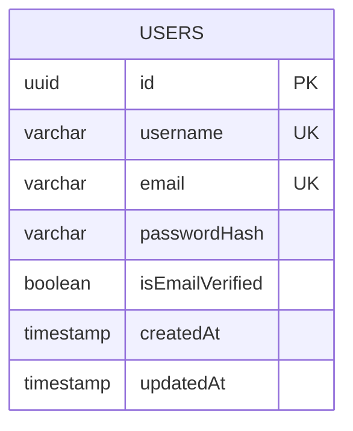

Redis OTP khong phai relational table, nhung quan he logic:

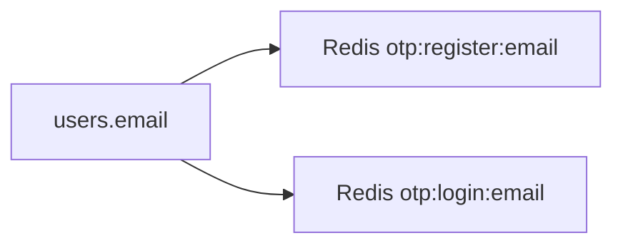

---

## 6. Phan tich Authentication

### 6.1 Dang ky

Flow:

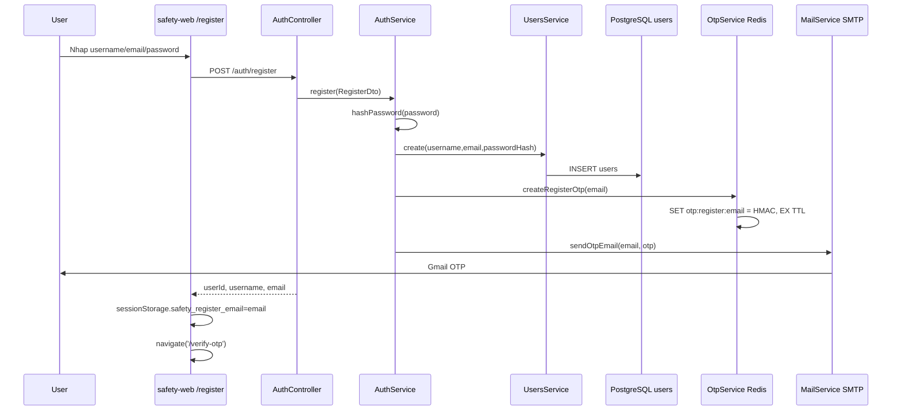

File chiu trach nhiem:

- UI register: `safety-web/src/App.jsx`, function `RegisterPage`.
- API call: `safety-web/src/api.js`, `apiPost`.
- Endpoint: `safety-auth/src/auth/auth.controller.ts`, `@Post('register')`.
- Business: `safety-auth/src/auth/auth.service.ts`, `register`.
- User DB: `safety-auth/src/users/users.service.ts`, `create`.
- User schema: `safety-auth/src/users/user.entity.ts`.
- OTP: `safety-auth/src/otp/otp.service.ts`, `createRegisterOtp`.
- Mail: `safety-auth/src/mail/mail.service.ts`, `sendOtpEmail`.

### 6.2 Verify OTP register

Flow:

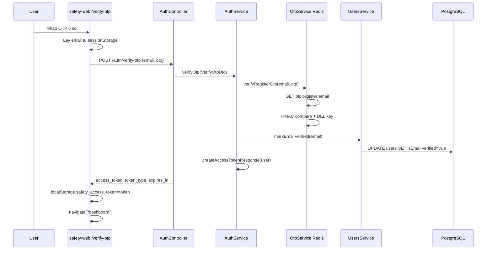

OTP duoc kiem tra trong `OtpService.verifyOtp`, wrapper `verifyRegisterOtp`. Token duoc tao trong `AuthService.createAccessTokenResponse`, goi `signAccessToken`.

### 6.3 Login

Flow login chinh hien tai la OTP 2 buoc:

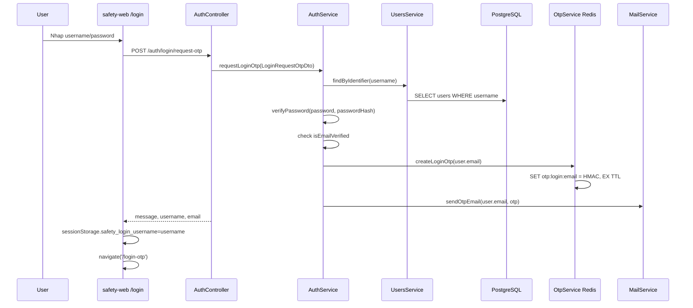

Verify login OTP:

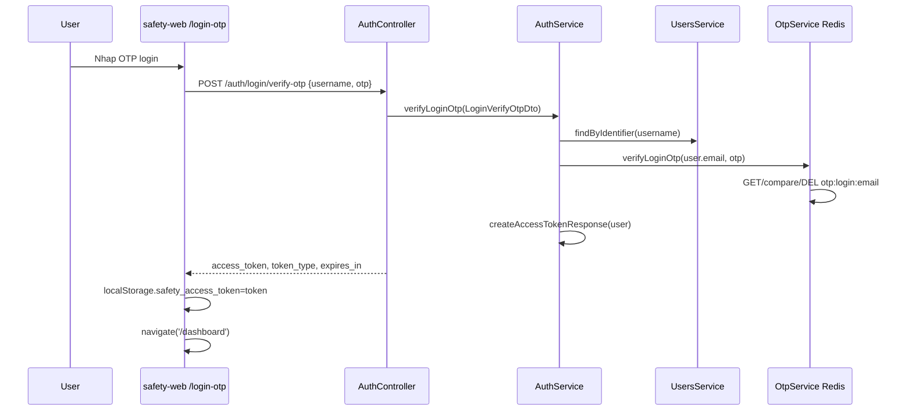

### 6.4 JWT

JWT duoc tao trong `AuthService.signAccessToken`:

- Secret: `JWT_SECRET` tu env.
- Payload: `{ sub: user.id, email: user.email }`.
- Expiration: `JWT_EXPIRES_IN`, mac dinh `1d`.
- Response format moi: `access_token`, `token_type`, `expires_in`.

Chua co:

- Refresh token.
- Token blacklist/revocation.
- JWT guard bao ve API dashboard.
- User profile endpoint validate token.

Frontend chi dung token de quyet dinh hien `/dashboard`, chua co API protected resource.

---

## 7. Phan tich Frontend

### 7.1 Tong quan

Frontend nam trong `safety-web`. Ung dung React gom mot file page chinh `src/App.jsx`, API wrapper `src/api.js` va stylesheet `src/styles.css`.

### 7.2 Routing

Khong dung React Router. Routing tu viet:

- `routes`: Set cac route hop le.
- `navigate(path)`: pushState va emit popstate.
- `useRoute()`: update state theo URL.

Routes:

| Route | Component | Muc dich |
| --- | --- | --- |
| `/register` | `RegisterPage` | Dang ky username/email/password |
| `/verify-otp` | `VerifyOtpPage` | Verify OTP register |
| `/login` | `LoginPage` | Request OTP login bang username/password |
| `/login-otp` | `LoginOtpPage` | Verify OTP login |
| `/dashboard` | `DashboardPage` | Trang thanh cong sau auth |

### 7.3 Components

Trong `App.jsx`:

- `Shell`: layout card, brand Safety, title/subtitle, aside link.
- `Field`: input field co icon.
- `Message`: hien error/success.
- `RegisterPage`, `VerifyOtpPage`, `LoginPage`, `LoginOtpPage`, `DashboardPage`.

### 7.4 Services

#### `safety-web/src/api.js`

- `API_BASE_URL = import.meta.env.VITE_API_BASE_URL || 'http://localhost:3000'`.
- `apiPost(path, payload, fallbackError)` dung `fetch`.
- Parse JSON response, normalize error.

### 7.5 Page detail

#### Register Page

File/function: `safety-web/src/App.jsx` -> `RegisterPage`.

Chuc nang:

- Nhap username/email/password.
- Submit `POST /auth/register`.
- Neu thanh cong: luu `sessionStorage.safety_register_email`, navigate `/verify-otp`.
- Neu loi: hien message than thien.

#### Verify OTP Page

File/function: `VerifyOtpPage`.

Chuc nang:

- Lay email tu `sessionStorage.safety_register_email`.
- Neu khong co email: redirect `/register`.
- Submit `POST /auth/verify-otp`.
- Neu thanh cong: luu `localStorage.safety_access_token`, navigate `/dashboard`.

#### Login Page

File/function: `LoginPage`.

Chuc nang:

- Nhap username/password, khong dung email.
- Submit `POST /auth/login/request-otp`.
- Neu thanh cong: luu `sessionStorage.safety_login_username`, navigate `/login-otp`.

#### Login OTP Page

File/function: `LoginOtpPage`.

Chuc nang:

- Lay username tu `sessionStorage.safety_login_username`.
- Neu khong co username: redirect `/login`.
- Submit `POST /auth/login/verify-otp`.
- Neu thanh cong: luu `localStorage.safety_access_token`, navigate `/dashboard`.

#### Dashboard Page

File/function: `DashboardPage`.

Chuc nang:

- Neu khong co token: redirect `/login`.
- Hien thong bao dang nhap thanh cong.
- Logout xoa `localStorage.safety_access_token`, navigate `/login`.

---

## 8. Phan tich Docker

### 8.1 docker-compose.yml

Compose chinh nam o `docker-compose.yml`, gom cac service:

| Service | Image/Build | Port host | Nhiem vu |
| --- | --- | --- | --- |
| `safety-auth` | build `./safety-auth` | `3000:3000` | NestJS API |
| `safety-web` | `node:18` | `5173:5173` | Vite dev frontend |
| `postgres` | `postgres:16` | internal only | Database users |
| `redis` | `redis:7` | internal only | OTP temporary store |
| `nginx` | `nginx:latest` | `8080:80`, `8443:443` | Reverse proxy to backend |

### 8.2 Ports

- `5173`: frontend Vite.
- `3000`: backend NestJS.
- `8080`: Nginx HTTP proxy.
- `8443`: Nginx HTTPS port exposed, nhung config hien tai chua co TLS server block.
- PostgreSQL/Redis khong publish ra host trong compose chinh.

### 8.3 Volumes

- `postgres_data:/var/lib/postgresql/data`: persistence DB.
- `redis_data:/data`: persistence Redis.
- `./safety-web:/app`: mount source frontend vao node container.
- `./nginx/nginx.conf:/etc/nginx/conf.d/default.conf:ro`.
- `./certs:/etc/nginx/certs:ro`.

### 8.4 Networks

- `safety-net`: bridge network dung chung.

### 8.5 Container detail

#### safety-auth

- Build tu `safety-auth/Dockerfile`.
- Depends on Postgres/Redis healthy.
- Doc env tu `.env` va `environment` override.
- Ket noi DB/Redis bang Docker hostname.

#### safety-web

- Chay `node:18`.
- `working_dir: /app`.
- Mount `./safety-web:/app`.
- Command: `npm install && npm run dev -- --host 0.0.0.0`.
- Phu hop dev/test. Production nen build static va serve bang Nginx.

#### postgres

- Image `postgres:16`.
- Healthcheck `pg_isready`.
- Volume `postgres_data` giu user data.

#### redis

- Image `redis:7`.
- Command `redis-server --requirepass ${REDIS_PASSWORD}`.
- Healthcheck `redis-cli -a password ping`.

#### nginx

- Proxy `/` den `safety-auth:3000`.
- Chua proxy frontend.

---

## 9. Phan tich Wazuh

### 9.1 Trang thai hien tai

Wazuh hien co source trong `wazuh-docker/`, nhung khong duoc include vao compose chinh. Dieu nay dung voi chien luoc hien tai: tam dung Wazuh, uu tien Safety Auth.

### 9.2 Wazuh Manager

Trong `wazuh-docker/single-node/docker-compose.yml`:

- Service `wazuh.manager` dung image `wazuh/wazuh-manager:4.14.0`.
- Port:
  - `1514`: agent events.
  - `1515`: agent enrollment.
  - `514/udp`: syslog.
  - `55000`: Wazuh API.
- Volumes luu config, logs, queue, integrations.
- Ket noi Indexer qua `INDEXER_URL`.

### 9.3 Wazuh Indexer

- Service `wazuh.indexer` hoac `wazuh1/2/3.indexer` trong multi-node.
- Image `wazuh/wazuh-indexer:4.14.0`.
- Port `9200`.
- Luu index data trong volume.
- Dung cert trong `config/wazuh_indexer_ssl_certs`.

### 9.4 Wazuh Dashboard

- Service `wazuh.dashboard`.
- Image `wazuh/wazuh-dashboard:4.14.0`.
- Map port `443:5601` trong Wazuh compose rieng.
- Ket noi Wazuh API va Indexer.

### 9.5 Luong du lieu du kien

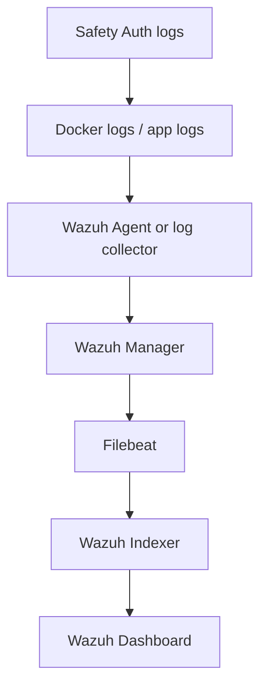

### 9.6 Khoang cach hien tai

- `safety-auth` chua co logger structured.
- Chua co Wazuh agent trong compose chinh.
- Chua co shipping logs tu Docker container Safety sang Wazuh.
- Bien Wazuh API co trong `.env` nhung backend chua co service su dung.

---

## 10. Cac Flow Nghiep Vu

### 10.1 Register

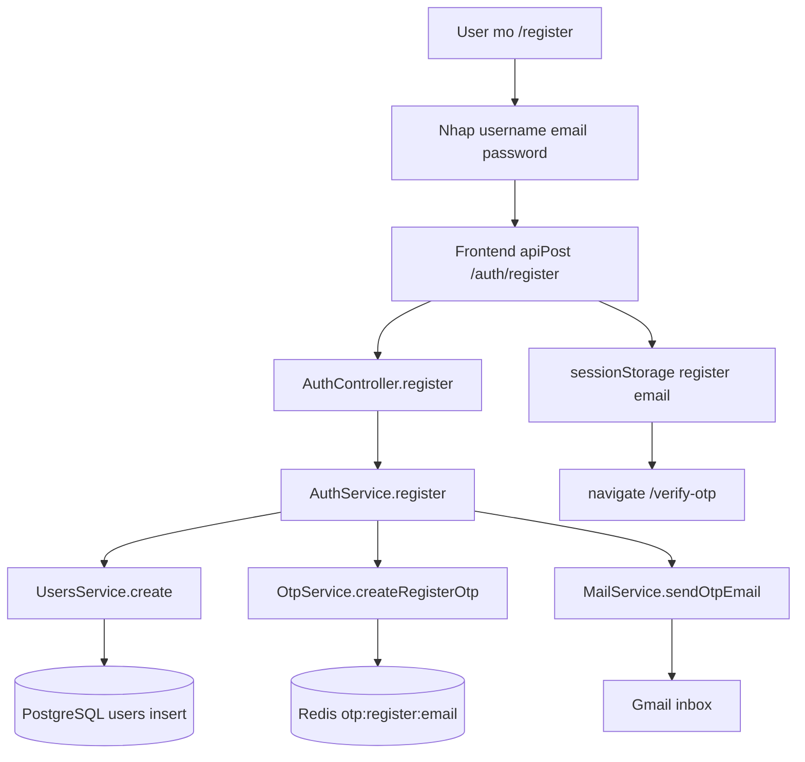

### 10.2 Verify OTP register

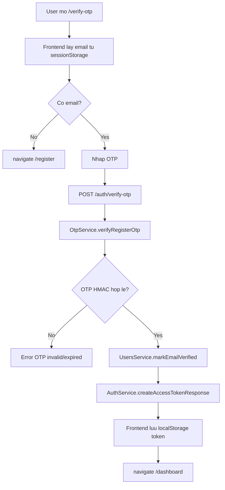

### 10.3 Login

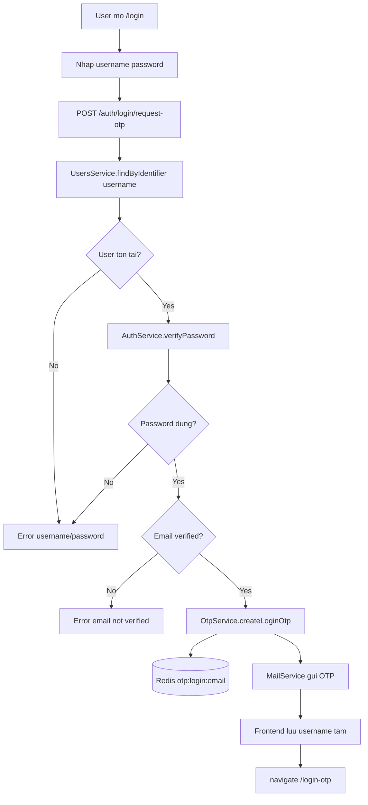

### 10.4 Login OTP

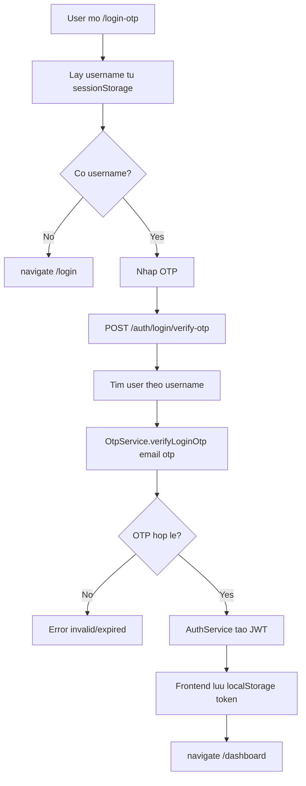

### 10.5 Logout

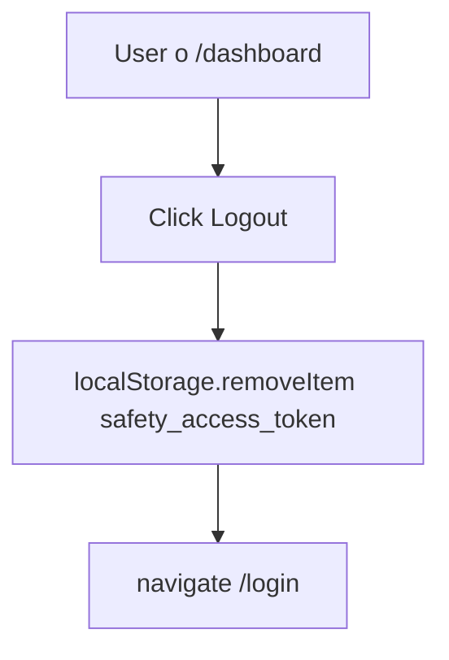

### 10.6 Refresh Token

Hien tai **chua co refresh token**. Flow hien tai:

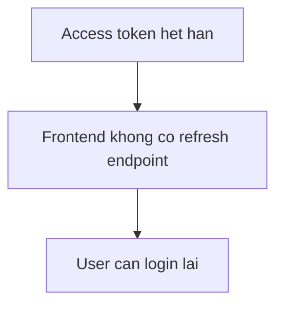

De xuat flow tuong lai:

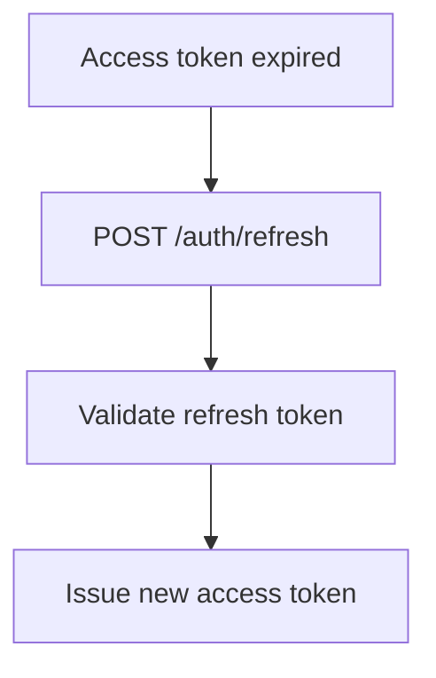

### 10.7 Dashboard Access

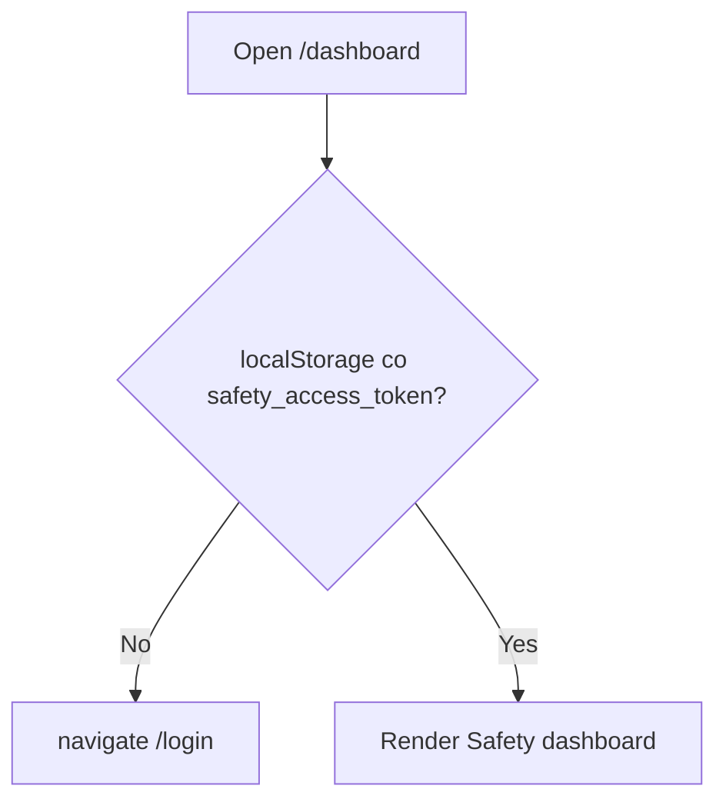

Ghi chu: day la guard frontend don gian, khong phai authorization server-side.

---

## 11. Tien do hien tai

| Chuc nang | Trang thai | Ghi chu |
| --- | --- | --- |
| Frontend React/Vite | Hoan thanh | `safety-web`, chay port 5173 |
| Register UI | Hoan thanh | username/email/password |
| Verify OTP register UI | Hoan thanh | verify xong vao dashboard |
| Login UI | Hoan thanh | username/password, khong dung email |
| Login OTP UI | Hoan thanh | username lay tu sessionStorage |
| Dashboard UI | Hoan thanh | man hinh thanh cong + logout |
| Backend register | Hoan thanh | tao user, hash password, gui OTP |
| Backend verify register OTP | Hoan thanh | verify OTP, mark verified, tra JWT |
| Backend login OTP request | Hoan thanh | username/password -> gui OTP ve email |
| Backend login OTP verify | Hoan thanh | username/otp -> JWT |
| Password hashing | Hoan thanh | scrypt + salt |
| JWT access token | Hoan thanh | expires `JWT_EXPIRES_IN` |
| Refresh token | Chua lam | Chua co endpoint/database |
| Protected API guard | Chua lam | Dashboard chi guard frontend localStorage |
| PostgreSQL persistence | Hoan thanh | Volume `postgres_data` |
| Redis OTP | Hoan thanh | hash + TTL |
| Gmail SMTP | Hoan thanh | Nodemailer |
| Docker Compose app chinh | Hoan thanh | safety-auth/web/postgres/redis/nginx |
| Nginx reverse proxy | Dang phat trien | Proxy backend, chua proxy frontend/TLS active |
| Wazuh source | Co san | Chua tich hop compose chinh |
| Wazuh integration | Chua lam | Chua ship logs/app events |
| Audit log | Chua lam | Chua co bang/logging strategy |
| Automated e2e auth tests | Chua lam | Moi co test app controller mac dinh |

---

## 12. Cac van de ton tai

### 12.1 Technical Debt

- `safety-web/src/App.jsx` gom tat ca page/component trong mot file. Nen tach thanh `pages/`, `components/`, `services/` khi du an lon hon.
- Routing tu viet bang History API. Nen dung React Router neu can nested route/protected route ro rang.
- Backend `AuthService` vua xu ly password hashing, JWT, OTP orchestration. Nen tach `TokenService` hoac `PasswordService` khi mo rong.
- `POST /auth/login` cu van ton tai va bypass OTP neu dung email/password. Flow chinh la OTP, nen can disable hoac gioi han endpoint cu.

### 12.2 Bug/Risk

- `apiPost` parse JSON bang `JSON.parse(text)` khong catch parse error. Neu backend tra text khong phai JSON, frontend se throw loi parse.
- `DashboardPage` chi kiem tra token co ton tai, khong validate token voi backend.
- `useRoute()` neu path invalid return component nhung khong rewrite URL. Nguoi dung co the thay URL khong hop le nhung UI login/dashboard.

### 12.3 Security Risk

- `.env` chua secrets va password SMTP/DB/JWT. Can dam bao khong commit len repo public.
- `TYPEORM_SYNCHRONIZE=true` mac dinh khong phu hop production.
- JWT khong co refresh token, revoke token, blacklist token.
- Access token luu trong `localStorage`, de bi anh huong boi XSS. Can CSP va sanitize nghiem tuc hoac chuyen sang httpOnly cookie trong production.
- Chua co rate limit cho OTP/register/login. De bi brute force/OTP spam.
- OTP email subject/body hien don gian, chua co template/rate tracking.
- Redis healthcheck dung password command line trong compose co warning neu tuong tu CLI manual.
- Wazuh config va env co password mau/secret can rotate truoc production.

### 12.4 Docker Issue

- `safety-web` chay `npm install` moi lan container start. Tien loi dev nhung cham va khong phu hop production.
- `safety-auth` Docker build context co the lon neu khong co `.dockerignore` loai `node_modules/dist` hieu qua. Build tung thay context lon.
- Nginx expose `8443` nhung config hien chua co TLS server block.

### 12.5 Performance Issue

- Moi lan `MailService.sendOtpEmail` tao transporter moi. Nen tao transporter singleton neu traffic cao.
- Brute-force OTP trong Redis verify khong van de, nhung can rate limit theo username/email/IP.
- Frontend Vite dev server khong nen dung production.

---

## 13. De xuat giai doan tiep theo

### P1 - Bat buoc truoc demo/deploy noi bo

| Cong viec | Uoc luong | Ly do |
| --- | --- | --- |
| Them rate limit cho register/login/request OTP/verify OTP | 0.5-1 ngay | Giam brute force va spam email |
| Disable hoac bao ve `/auth/login` cu | 0.25 ngay | Tranh bypass OTP flow |
| Them JWT guard + endpoint `/auth/me` | 0.5 ngay | Dashboard validate token that |
| Chuyen secret ra env an toan, tao `.env.example` root | 0.5 ngay | Giam rui ro lo secret |
| Them `.dockerignore` cho `safety-auth` | 0.25 ngay | Tang toc Docker build |

### P2 - Hoan thien san pham

| Cong viec | Uoc luong | Ly do |
| --- | --- | --- |
| Tach frontend pages/components/services | 1 ngay | De maintain |
| Them React Router | 0.5 ngay | Route guard ro rang |
| Them production Dockerfile cho safety-web | 0.5-1 ngay | Serve static bang Nginx |
| Them audit log table | 1 ngay | Theo doi dang nhap/OTP/security events |
| Them test unit/e2e cho auth flow | 1-2 ngay | Chong regression |
| Them resend OTP co cooldown | 0.5 ngay | UX va security tot hon |

### P3 - Tich hop Wazuh va production hardening

| Cong viec | Uoc luong | Ly do |
| --- | --- | --- |
| Tich hop Docker logs voi Wazuh Agent | 1-2 ngay | SIEM monitoring |
| Tao dashboard rule cho failed login/OTP failures | 1-2 ngay | Phat hien tan cong |
| TLS Nginx production | 0.5-1 ngay | Bao mat transport |
| Refresh token rotation | 1-2 ngay | Session lifecycle chuan hon |
| CI build/test | 1 ngay | Dam bao build on commit |

---

## 14. Ket luan

Safety Auth hien da co nen tang xac thuc chinh hoat dong duoc end-to-end:

- Frontend register/login/OTP/dashboard da co.
- Backend register, verify email OTP, login OTP da co.
- PostgreSQL luu user, Redis luu OTP hash, Gmail SMTP gui OTP.
- Docker Compose co the khoi dong toan bo app bang `docker compose up -d`.
- Wazuh source da san sang de nghien cuu/tich hop sau, nhung chua duoc noi vao runtime app chinh.

Danh gia muc do hoan thien hien tai:

**Khoang 65% cho prototype/demo Safety Auth**, vi cac flow chinh da chay duoc, UI co, Docker co.  
**Khoang 40% cho production-ready security platform**, vi con thieu refresh token, rate limit, audit log, protected API guard, hardening secret, production frontend serving va Wazuh integration that.

---

## Phu luc A - Lenh van hanh nhanh

Khoi dong:

```bash
cd /home/de180538_vutruonghuy/Project
docker compose up -d
```

Xem trang thai:

```bash
docker compose ps
```

Xem log frontend:

```bash
docker compose logs -f safety-web
```

Xem log backend:

```bash
docker compose logs -f safety-auth
```

Tat container nhung giu data:

```bash
docker compose down
```

Can tranh neu khong muon mat data:

```bash
docker compose down -v
```

---

## Phu luc B - API summary

| Endpoint | Payload | Response thanh cong |
| --- | --- | --- |
| `POST /auth/register` | `{username,email,password}` | `{message,userId,username,email}` |
| `POST /auth/verify-otp` | `{email,otp}` | `{access_token,token_type,expires_in}` |
| `POST /auth/login/request-otp` | `{username,password}` | `{message,username,email}` |
| `POST /auth/login/verify-otp` | `{username,otp}` | `{access_token,token_type,expires_in}` |
| `POST /auth/login` | `{email,password}` | `{accessToken,tokenType,expiresIn}` legacy |
